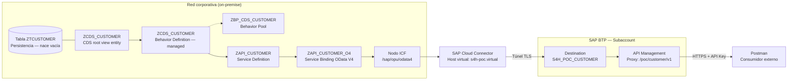

# ET-001 — Especificación Técnica

## PoC: API OData V4 transaccional sobre S/4HANA expuesta vía BTP

**Caso piloto para la migración de interfaces PI/PO hacia APIs y SAP BTP**

| Campo | Valor |
|---|---|
| Identificador | ET-001 |
| Versión | 2.0 |
| Estado | Borrador para revisión |
| Sistema origen | SAP S/4HANA 2025 (on-premise / Private Cloud Edition) |
| Repositorio | `Oneconnect_ECC` |
| Paquete propuesto | `ZPOC_API_MIG` (nuevo, independiente de `ZONECONNECT`) |
| Tipo de interfaz | Síncrona, transaccional (alta, consulta, modificación y baja) |

---

## 1. Objetivo y alcance

### 1.1 Objetivo

Construir de extremo a extremo, **desde cero y sin reutilizar ningún objeto existente**, una interfaz transaccional que permita **dar de alta y consultar registros** en SAP S/4HANA 2025 desde un consumidor externo, empleando exclusivamente tecnología actual:

Tabla Z → CDS View → RAP Business Object → SAP Cloud Connector → SAP BTP → API Management → Postman

El resultado es un **patrón de referencia replicable**: la PoC no vale por el dato que almacena, sino por establecer la cadena de herramientas, conexiones, convenciones de nombres y controles de seguridad que se reutilizarán en la migración del resto de interfaces PI/PO.

### 1.2 Alcance funcional

Servicio OData V4 de **lectura y escritura** sobre una entidad de clientes creada específicamente para la PoC. La tabla de persistencia **nace vacía**: los registros se dan de alta uno a uno desde Postman.

| Concepto | Campo de tabla | Elemento de datos | Alias expuesto | Clave |
|---|---|---|---|---|
| Número de cliente | `KUNNR` | `KUNNR` | `Customer` | Sí |
| Ciudad | `ORT01` | `ORT01` | `CityName` | No |
| Región / Estado | `REGIO` | `REGIO` | `Region` | No |
| País | `LAND1` | `LAND1` | `Country` | No |

Operaciones expuestas:

| Verbo HTTP | Operación RAP | Función |
|---|---|---|
| `POST` | `create` | Alta de un registro |
| `GET` | `read` / query | Consulta individual y por lista |
| `PATCH` | `update` | Modificación de un registro existente |
| `DELETE` | `delete` | Baja de un registro |

El servicio soporta además las opciones de consulta estándar de OData V4: `$select`, `$filter`, `$top`, `$skip`, `$orderby`, `$count`.

#### Por qué una tabla propia y no `KNA1`

La PoC persiste en una tabla Z creada para el caso (`ZTCUSTOMER`), no en el maestro de clientes estándar. Es una decisión deliberada y no negociable:

| Motivo | Detalle |
|---|---|
| Integridad del maestro | `KNA1` está sujeta a la sincronización CVI con Business Partner. Una escritura directa en tabla omitiría esa lógica y dejaría el maestro inconsistente |
| Aislamiento de la PoC | Una prueba de concepto no debe poder alterar datos maestros productivos |
| Requisito "todo nuevo" | La tabla, como el resto de objetos, se crea desde cero para este caso |

La vía correcta para escribir sobre clientes reales es la API estándar de Business Partner. Se detalla en §13.1.

> **Una vista CDS no puede almacenar datos.** Es una proyección sobre una persistencia existente: no tiene almacenamiento propio, no puede "estar vacía" y no admite escritura por sí misma. Por eso el primer objeto de la cadena es una tabla transparente y la CDS es el segundo. Este punto es la causa más frecuente de malentendidos al diseñar un servicio RAP de alta.

### 1.3 Fuera de alcance

Se declara explícitamente para evitar que la PoC se interprete como un patrón universal:

| Excluido | Motivo y patrón correcto |
|---|---|
| Escritura sobre maestros estándar (`KNA1`, Business Partner) | Requiere la API estándar de BP, no un RAP BO propio. Ver §13.1 |
| Gestión de borrador (*draft*) | Propia de escenarios con interfaz de usuario Fiori. En A2X no aporta |
| Carga masiva de registros | La PoC da de alta uno a uno. Para volumen, ver `$batch` en §13.4 |
| Interfaces asíncronas de salida (IDoc, proxies ABAP) | No migran a OData. Patrón correcto: RAP Business Events + SAP Event Mesh |
| Interfaces de fichero (adaptador File/SFTP de PI/PO) | Patrón correcto: iFlow de SAP Cloud Integration |
| Mapeos y transformaciones complejas | Patrón correcto: SAP Cloud Integration |
| Alta disponibilidad, sizing y dimensionamiento productivo | La PoC se despliega en entorno de desarrollo |

> **Advertencia de alcance.** El grueso del tráfico histórico de PI/PO en un ECC es **asíncrono de tipo push**. Esta PoC demuestra los patrones **síncronos** de consulta y de actualización. Antes de generalizar el patrón a todo el inventario de interfaces, es necesario clasificar cada interfaz por tipo (síncrona/asíncrona, consulta/actualización) y asignarle el patrón destino que corresponda.

---

## 2. Contexto: de PI/PO a APIs

SAP Process Integration / Process Orchestration alcanza el fin de su mantenimiento estándar y la estrategia de integración de SAP se apoya ahora en **SAP Integration Suite** sobre BTP. La migración no es un reemplazo uno a uno del middleware: cada interfaz debe reevaluarse y asignarse al patrón de integración adecuado.

### 2.1 Matriz de reasignación de patrones

| # | Patrón en PI/PO | Patrón destino | Componentes |
|---|---|---|---|
| 1 | Proxy ABAP síncrono de consulta | **API OData V4 de lectura** | CDS + Service Binding + API Management |
| 2 | Proxy ABAP síncrono de actualización | **API OData V4 transaccional** | CDS + RAP `managed` + API Management |
| 3 | RFC síncrono de consulta | API OData V4 de lectura | CDS + Service Binding + API Management |
| 4 | Servicio SOAP síncrono | API REST/OData, o Cloud Integration si hay mapeo | API Management / Cloud Integration |
| 5 | IDoc entrante | API OData V4 transaccional | CDS + RAP `managed` + API Management |
| 6 | IDoc saliente asíncrono | **Eventos** | RAP Business Events + Event Mesh |
| 7 | Proxy ABAP asíncrono de salida | **Eventos** | RAP Business Events + Event Mesh |
| 8 | Interfaz de fichero | **iFlow** | Cloud Integration + adaptador SFTP |
| 9 | Interfaz con mapeo/enriquecimiento | **iFlow** | Cloud Integration |

**Esta PoC implementa las filas 1 y 2 de la matriz**, que juntas cubren el ciclo completo de lectura y escritura síncronas. La fila 5, IDoc entrante, es el mismo patrón que la fila 2 y se migra con los mismos objetos.

### 2.2 Ventajas del patrón frente a PI/PO

- Elimina un salto de red y un componente de middleware en escenarios síncronos.
- El contrato de la API se genera a partir del modelo de datos (`$metadata`), no se mantiene manualmente.
- Las capacidades de consulta (`$filter`, `$select`, paginación) son declarativas: el consumidor decide qué pide, sin desarrollar una variante por cada necesidad.
- RAP aporta de serie bloqueo, control de autorizaciones, validaciones y determinaciones, sin escribir la fontanería transaccional a mano.
- La seguridad, el control de tráfico y la monetización se gestionan en API Management, fuera del código ABAP.

---

## 3. Arquitectura de la solución

### 3.1 Diagrama de flujo



El flujo de **lectura** recorre el diagrama de izquierda a derecha. El de **escritura** lo recorre en sentido inverso: el `POST` de Postman atraviesa API Management, la destination, el túnel del Cloud Connector y el nodo ICF, y RAP materializa el registro en `ZTCUSTOMER`.

### 3.2 Fases de validación

La cadena se valida por capas. **No se avanza a la fase siguiente sin cerrar la anterior**, porque diagnosticar un fallo con los siete componentes encadenados es inviable.

| Fase | Qué se valida | Punto de prueba |
|---|---|---|
| **F1** | Modelo de datos y persistencia | Data Preview en ADT sobre la CDS (devuelve vacío, sin error) |
| **F2** | Objeto de negocio RAP | Alta y consulta desde Postman contra el backend, dentro de la red corporativa |
| **F3** | Túnel | Botón *Check Connection* en la Destination de BTP |
| **F4** | API publicada | Alta y consulta desde Postman contra el API Proxy, desde fuera de la red |

> En **F1** la vista devuelve cero registros: es el resultado correcto. La tabla nace vacía y solo se poblará en F2, con el primer `POST`. Un error de activación o una excepción sí serían fallo; un resultado vacío, no.

---

## 4. Inventario de herramientas

| # | Herramienta | Versión mínima | Dónde se instala | Responsable | Uso en esta PoC |
|---|---|---|---|---|---|
| 1 | **Eclipse IDE for Java Developers** + **ABAP Development Tools (ADT)** | Eclipse 2024-09 / ADT 3.40 | Puesto del desarrollador | Desarrollo ABAP | Crear CDS, Service Definition y Service Binding (§6) |
| 2 | **SAP GUI for Windows** | 8.00 PL | Puesto del desarrollador | Desarrollo / Basis | SICF, SU01, PFCG, SU53, `/IWFND/V4_ADMIN` (§7) |
| 3 | **SAP Cloud Connector** | 2.16 o superior | Servidor en la DMZ corporativa | Basis / Redes | Túnel seguro on-premise ↔ BTP (§8) |
| 4 | **SAP BTP Cockpit** | SaaS | Navegador | Arquitectura BTP | Subaccount, entitlements, destinations (§9) |
| 5 | **SAP Integration Suite — API Management** | SaaS | Navegador | Arquitectura BTP | Publicar el API con endpoint alcanzable (§10) |
| 6 | **Postman** | 11.x | Puesto del desarrollador | Desarrollo / QA | Consumo y pruebas (§11) |

### 4.1 Nota sobre ADT

ADT es **obligatorio**. Los objetos CDS, Service Definition y Service Binding no son mantenibles desde SAP GUI: no existe transacción equivalente. SE80 no los edita. La instalación se realiza desde el update site oficial de SAP para ABAP Development Tools.

### 4.2 Nota sobre API Management

**API Management no es opcional en esta cadena.** Es un error de diseño frecuente asumir que una *Destination* de BTP publica una URL consumible desde Internet. No lo hace: una Destination es un objeto de configuración que las aplicaciones **desplegadas dentro de BTP** leen a través del Destination Service y del Connectivity Service. No tiene endpoint propio, y por tanto **Postman no puede invocarla**.

Para que un consumidor externo alcance el servicio hacen falta las filas 5 y 6 del inventario: un API Proxy que sí publica un endpoint HTTPS accesible. La alternativa sería desplegar un approuter en Cloud Foundry, opción descartada aquí por añadir código y ciclo de despliegue sin aportar al objetivo de la PoC.

---

## 5. Inventario de conexiones

| # | Origen | Destino | Protocolo / Puerto | Autenticación | Configurado en |
|---|---|---|---|---|---|
| C1 | Eclipse (ADT) | S/4HANA 2025 | DIAG / 32NN | Usuario de diálogo | §6.1 |
| C2 | Cloud Connector | S/4HANA 2025 | HTTPS / 443NN | No aplica (nivel de red) | §8.3 |
| C3 | Cloud Connector | Subaccount BTP | Túnel TLS saliente / 443 | S-user o API token | §8.2 |
| C4 | Destination BTP | Host virtual del CC | HTTPS vía `ProxyType=OnPremise` | Basic (usuario técnico) | §9.2 |
| C5 | API Management | Destination / API Provider | HTTPS vía Cloud Connector | Basic (Key Value Map) | §10.2 |
| C6 | Postman | API Proxy | HTTPS / 443 | API Key u OAuth 2.0 | §11.2 |

### 5.1 Requisitos de red (a tramitar con Redes/Seguridad)

| Requisito | Detalle |
|---|---|
| Salida del Cloud Connector | El servidor del CC necesita salida HTTPS (443) hacia el endpoint de la región BTP. **La conexión siempre la inicia el Cloud Connector hacia BTP**; no se abre ningún puerto entrante en el firewall corporativo |
| Resolución DNS | El servidor del CC debe resolver el hostname del servidor S/4HANA |
| Certificados | Si el S/4HANA presenta certificado emitido por una CA interna, debe importarse en el truststore del Cloud Connector |
| Acceso administrativo al CC | Puerto 8443 hacia la interfaz de administración, restringido a los administradores |

---

## 6. Paso a paso — Eclipse / ADT

Los seis objetos ABAP de la PoC se crean en este orden. **El orden importa**: cada objeto referencia al anterior y no activa si el precedente no existe.

| # | Objeto | Tipo | Depende de |
|---|---|---|---|
| 1 | `ZTCUSTOMER` | Tabla transparente | — |
| 2 | `ZCDS_CUSTOMER` | CDS root view entity | 1 |
| 3 | `ZCDS_CUSTOMER` | Behavior Definition | 2 |
| 4 | `ZBP_CDS_CUSTOMER` | Clase de comportamiento | 3 |
| 5 | `ZAPI_CUSTOMER` | Service Definition | 2 |
| 6 | `ZAPI_CUSTOMER_O4` | Service Binding | 5 |

### 6.1 Conexión C1: crear el proyecto ABAP

1. Abrir Eclipse → `File` → `New` → `Other` → `ABAP` → `ABAP Project`.
2. Seleccionar el sistema S/4HANA 2025 desde el fichero `SAPUILandscape.xml` (el mismo que usa SAP GUI), o introducir manualmente *System ID*, *Application Server* y *Instance Number*.
3. Introducir mandante, usuario y contraseña. Idioma: `ES` o `EN` (el idioma maestro del repositorio es `E`).
4. Verificar que el proyecto aparece en el *Project Explorer* y que se expande el árbol de paquetes.

### 6.2 Crear el paquete

1. Clic derecho sobre `$TMP` o sobre el nodo de la estructura de paquetes → `New` → `ABAP Package`.
2. Cumplimentar:

| Campo | Valor |
|---|---|
| Name | `ZPOC_API_MIG` |
| Description | `PoC migración interfaces PI/PO a APIs` |
| Package Type | `Development` |
| Software Component | `HOME` |
| Transport Layer | El del sistema (habitualmente `ZDEV`) |

3. Asignar una **orden de transporte de workbench** nueva. Anotar su número: será el vehículo de todos los objetos de la PoC.

> El paquete es nuevo e independiente del paquete `ZONECONNECT` existente. Los desarrollos de la PoC no deben mezclarse con el código ECC heredado del repositorio.

### 6.3 Tabla de persistencia `ZTCUSTOMER`

Es el primer objeto y el único que almacena datos. Nace vacía y se poblará desde Postman.

1. Clic derecho sobre `ZPOC_API_MIG` → `New` → `Other ABAP Repository Object` → `Dictionary` → `Database Table`.
2. Name: `ZTCUSTOMER` — Description: `PoC - Clientes cargados vía API`.
3. Sustituir el contenido por:

```abap
@EndUserText.label : 'PoC - Clientes cargados vía API'
@AbapCatalog.enhancement.category : #NOT_EXTENSIBLE
@AbapCatalog.tableCategory : #TRANSPARENT
@AbapCatalog.deliveryClass : #A
@AbapCatalog.dataMaintenance : #RESTRICTED
define table ztcustomer {
  key mandt : mandt not null;
  key kunnr : kunnr not null;
  ort01     : ort01;
  regio     : regio;
  land1     : land1;
}
```

4. Activar con `Ctrl+F3`.

#### Decisiones de diseño

| Decisión | Motivo |
|---|---|
| Elementos de datos estándar (`kunnr`, `ort01`, `regio`, `land1`) | Se heredan longitud, ayuda de búsqueda y textos descriptivos de SAP, sin crear dominios ni elementos propios |
| `mandt` como primera clave | Obligatorio en tablas dependientes de mandante. RAP y CDS lo gestionan de forma implícita: no se expone nunca en la API |
| `kunnr` como única clave semántica | Corresponde a los cuatro campos solicitados. La alternativa —clave técnica UUID— se comenta más abajo |
| `deliveryClass : #A` | Tabla de datos de aplicación. No se transporta su contenido, solo la estructura |
| `dataMaintenance : #RESTRICTED` | Impide el mantenimiento por SM30. Los datos entran por la API, que es el objetivo de la PoC |
| Sin campos administrativos | Se ciñe a los cuatro campos solicitados. Para control de concurrencia, ver §13.5 |

> **Clave semántica frente a clave técnica.** RAP recomienda una clave técnica UUID para objetos de negocio nuevos, porque desacopla la identidad interna del identificador de negocio. Aquí se usa `KUNNR` como clave por dos razones: son los cuatro campos solicitados, y el consumidor externo necesita poder direccionar el registro por su número de cliente. Si en una interfaz real el identificador de negocio pudiera cambiar, la clave debe ser un UUID y `KUNNR` un campo más.

### 6.4 Vista CDS `ZCDS_CUSTOMER`

1. Clic derecho sobre `ZPOC_API_MIG` → `New` → `Other ABAP Repository Object` → `Core Data Services` → `Data Definition`.
2. Name: `ZCDS_CUSTOMER` — Description: `PoC - Clientes cargados vía API`.
3. Seleccionar la plantilla `Define Root View Entity`.
4. Sustituir el contenido por:

```abap
@EndUserText.label: 'PoC - Clientes cargados vía API'
@AccessControl.authorizationCheck: #NOT_REQUIRED
@Metadata.allowExtensions: true
define root view entity ZCDS_CUSTOMER
  as select from ztcustomer
{
      @EndUserText.label: 'Número de cliente'
  key kunnr as Customer,

      @EndUserText.label: 'Ciudad'
      ort01 as CityName,

      @EndUserText.label: 'Región / Estado'
      regio as Region,

      @EndUserText.label: 'País'
      land1 as Country
}
```

5. Activar con `Ctrl+F3`.
6. **Validación F1:** clic derecho sobre la vista → `Open With` → `Data Preview`. Debe abrirse **sin registros y sin error**. Un resultado vacío es el correcto: la tabla aún no tiene datos.

#### Decisiones de diseño

| Decisión | Motivo |
|---|---|
| **`define root view entity`** | La palabra `root` es **obligatoria**. Sin ella la vista no puede ser entidad raíz de un objeto de negocio RAP y la behavior definition del paso siguiente no activa |
| `define view entity` en lugar de `define view` | Las *view entities* son el estándar desde S/4HANA 2020. No generan vista SQL en DDIC y tienen mejores comprobaciones sintácticas |
| `@AccessControl.authorizationCheck: #NOT_REQUIRED` | Aceptable en PoC. **En productivo debe pasarse a `#CHECK` y definirse un rol DCL.** Ver §12.2 |
| Alias en inglés y *CamelCase* | Convención del Virtual Data Model de SAP. Estos alias son los nombres de campo que verá el consumidor de la API y forman parte del contrato |
| `MANDT` no se expone | El mandante es implícito en CDS. Nunca debe exponerse en una API |
| Sin projection view | Se expone la vista base directamente, para mantener la cadena mínima. En productivo conviene interponer una projection view; ver la nota al final de §6.7 |

### 6.5 Behavior Definition `ZCDS_CUSTOMER`

Es el objeto que convierte una vista de solo lectura en un objeto de negocio capaz de recibir altas. **Sin él, un `POST` desde Postman devuelve `405 Method Not Allowed`.**

1. Clic derecho sobre `ZCDS_CUSTOMER` → `New Behavior Definition`.
2. Implementation Type: **`Managed`**.
3. Sustituir el contenido por:

```abap
managed implementation in class zbp_cds_customer unique;
strict ( 2 );

define behavior for ZCDS_CUSTOMER alias Customer
persistent table ztcustomer
lock master
authorization master ( global )
{
  create;
  update;
  delete;

  field ( mandatory : create ) Customer;
  field ( readonly : update )  Customer;

  mapping for ztcustomer
    {
      Customer = kunnr;
      CityName = ort01;
      Region   = regio;
      Country  = land1;
    }
}
```

4. Activar con `Ctrl+F3`. La activación fallará hasta crear la clase del paso §6.6: es lo esperado.

#### Qué hace cada cláusula

| Cláusula | Función |
|---|---|
| `managed` | RAP genera la implementación de alta, modificación y baja. No hay que programar la escritura |
| `implementation in class zbp_cds_customer unique` | Declara la clase de comportamiento. `unique` obliga a que sea la única para este objeto |
| `strict ( 2 )` | Modo estricto de sintaxis, nivel 2. Aplica las comprobaciones más recientes y es el recomendado para desarrollo nuevo |
| `persistent table ztcustomer` | La tabla donde RAP materializa los registros |
| `lock master` | Este objeto gestiona su propio bloqueo. Obligatorio para `update` y `delete` |
| `authorization master ( global )` | El control de autorizaciones se resuelve una vez por operación, no por instancia. Se implementa en §6.6 |
| `field ( mandatory : create ) Customer` | Un `POST` sin `Customer` se rechaza con error de validación |
| `field ( readonly : update ) Customer` | Impide cambiar la clave con un `PATCH`, que produciría un registro huérfano |
| `mapping for ztcustomer` | Correspondencia entre los alias de la CDS y los campos físicos de la tabla |

> **`global` frente a `instance` en `authorization master`.** Con `global`, la autorización se evalúa por operación: "¿puede este usuario crear clientes?". Con `instance`, se evalúa además registro a registro: "¿puede crear *este* cliente?". La segunda obliga a implementar `get_instance_authorizations` y solo se justifica cuando el permiso depende del contenido del registro —por ejemplo, restringir por país. Para la PoC basta `global`; la variante por instancia se describe en §12.2.

### 6.6 Clase de comportamiento `ZBP_CDS_CUSTOMER`

1. Situar el cursor sobre `zbp_cds_customer` en la behavior definition y pulsar `Ctrl+1`.
2. Elegir el *quick fix* **`Create behavior implementation class`**. ADT genera el esqueleto y lo asigna al paquete.

La clase tiene dos partes. La **clase global** es una cáscara y no se toca:

```abap
CLASS zbp_cds_customer DEFINITION PUBLIC ABSTRACT FINAL
  FOR BEHAVIOR OF zcds_customer.
ENDCLASS.

CLASS zbp_cds_customer IMPLEMENTATION.
ENDCLASS.
```

La lógica vive en la pestaña **`Local Types`**, en la clase manejadora:

```abap
CLASS lhc_customer DEFINITION INHERITING FROM cl_abap_behavior_handler.
  PRIVATE SECTION.
    METHODS get_global_authorizations FOR GLOBAL AUTHORIZATION
      IMPORTING REQUEST requested_authorizations FOR Customer
      RESULT result.
ENDCLASS.

CLASS lhc_customer IMPLEMENTATION.
  METHOD get_global_authorizations.
    " PoC: se conceden todas las operaciones al usuario del servicio.
    " Endurecimiento para productivo: ver §12.2
    IF requested_authorizations-%create = if_abap_behv=>mk-on.
      result-%create = if_abap_behv=>auth-allowed.
    ENDIF.
    IF requested_authorizations-%update = if_abap_behv=>mk-on.
      result-%update = if_abap_behv=>auth-allowed.
    ENDIF.
    IF requested_authorizations-%delete = if_abap_behv=>mk-on.
      result-%delete = if_abap_behv=>auth-allowed.
    ENDIF.
  ENDMETHOD.
ENDCLASS.
```

3. Activar con `Ctrl+F3`, y volver a activar la behavior definition de §6.5, que ahora sí compila.

> **Esta clase es el punto de extensión del objeto de negocio.** Las validaciones, las determinaciones y las acciones de §13.2 se implementan aquí. En la PoC solo contiene la autorización global, que concede todo — lo cual es exactamente lo que §12 identifica como brecha frente a productivo.

### 6.7 Service Definition `ZAPI_CUSTOMER`

1. Clic derecho sobre `ZCDS_CUSTOMER` → `New Service Definition`.
2. Name: `ZAPI_CUSTOMER` — Description: `PoC - API transaccional de clientes`.
3. Contenido:

```abap
@EndUserText.label: 'PoC - API transaccional de clientes'
define service ZAPI_CUSTOMER {
  expose ZCDS_CUSTOMER as Customer;
}
```

4. Activar con `Ctrl+F3`.

> El alias `Customer` es el **nombre del entity set** en la URL de OData. Es parte del contrato público: cambiarlo después rompe a todos los consumidores.
>
> Se expone la vista base directamente. En un desarrollo productivo conviene interponer una **projection view** (`ZC_CUSTOMER as projection on ZCDS_CUSTOMER`) con su correspondiente *behavior projection*: permite alterar el contrato publicado —renombrar campos, restringir operaciones por consumidor— sin tocar el objeto de negocio. Se ha omitido aquí para mantener la cadena en el mínimo de objetos.

### 6.8 Service Binding `ZAPI_CUSTOMER_O4`

1. Clic derecho sobre `ZAPI_CUSTOMER` → `New Service Binding`.
2. Cumplimentar:

| Campo | Valor |
|---|---|
| Name | `ZAPI_CUSTOMER_O4` |
| Description | `PoC - Binding OData V4 transaccional` |
| Binding Type | **`OData V4 - Web API`** |
| Service Definition | `ZAPI_CUSTOMER` |

3. Activar con `Ctrl+F3`.
4. Pulsar el botón **`Publish`**. El estado debe pasar a *Published*, y la sección *Service Version* mostrar `0001`.
5. En el árbol del editor, desplegar la entidad `Customer` y verificar que aparecen las operaciones **Create, Update y Delete**. Si solo figura *Read*, la behavior definition no está activa o no se ha publicado el binding de nuevo tras crearla.
6. **Anotar la URL exacta** que muestra el editor bajo *Service URL*. Es el dato de entrada de §8 y §9.

#### Elección del Binding Type

| Tipo | Cuándo usarlo |
|---|---|
| `OData V4 - Web API` | **Esta PoC.** Consumo máquina a máquina (A2X). Sin anotaciones de UI, contrato limpio |
| `OData V4 - UI` | Solo si se va a construir una aplicación Fiori Elements sobre el servicio. Exige gestión de borrador |
| `OData V2 - UI / Web API` | Solo por compatibilidad con consumidores que no soporten V4 |

#### Patrón de la URL generada

```
https://<host>:<puerto>/sap/opu/odata4/sap/zapi_customer_o4/srvd_a2x/sap/zapi_customer/0001/
```

Descomposición:

| Segmento | Significado |
|---|---|
| `/sap/opu/odata4` | Nodo ICF raíz de OData V4 |
| `/sap` | Namespace del Service Binding |
| `/zapi_customer_o4` | Nombre del Service Binding, en minúsculas |
| `/srvd_a2x` | Tipo de binding: Service Definition, A2X (Web API) |
| `/sap/zapi_customer` | Namespace y nombre de la Service Definition |
| `/0001` | Versión del servicio |

El entity set cuelga de esa raíz: `.../0001/Customer`.

> Utilizar siempre la URL que muestra ADT. El patrón se documenta para su comprensión, no para componerla a mano.

### 6.9 Comprobación de calidad (ATC)

1. Clic derecho sobre el paquete `ZPOC_API_MIG` → `Run As` → `ABAP Test Cockpit`.
2. Resolver los hallazgos de prioridad 1 y 2 antes de liberar la orden de transporte.

Este paso es opcional para que la PoC funcione, pero **obligatorio si el patrón se va a replicar**: los defectos de convención que se pasen por alto aquí se multiplicarán por cada interfaz migrada.

---

## 7. Paso a paso — SAP GUI

### 7.1 Activar el nodo ICF de OData V4

1. Transacción **`SICF`**.
2. *Hierarchy Type*: `SERVICE`. Ejecutar (`F8`).
3. Navegar: `default_host` → `sap` → `opu` → `odata4`.
4. Verificar que el nodo está **activo**. Un nodo inactivo se muestra en gris; uno activo, en negro.
5. Si está inactivo: clic derecho → `Activar servicio` → confirmar incluyendo los subnodos.

> Sin este nodo activo, toda llamada devuelve **404**, con independencia de que el Service Binding esté publicado.

### 7.2 Crear el usuario técnico

1. Transacción **`SU01`**.
2. Usuario: `POC_API_USER` → `Crear`.

| Pestaña | Campo | Valor |
|---|---|---|
| Datos de dirección | Apellido | `Usuario técnico PoC API` |
| Datos de acceso | **Tipo de usuario** | **`Sistema`** |
| Datos de acceso | Contraseña | Generar una robusta y registrarla en la bóveda de secretos corporativa |
| Roles | Rol | `ZPOC_API_CUSTOMER` (se crea en §7.3) |

3. Grabar.

#### Elección del tipo de usuario

| Tipo | Válido aquí | Motivo |
|---|---|---|
| **Sistema** | **Sí** | Permite autenticación por contraseña en llamadas HTTP/RFC, bloquea el acceso de diálogo y la contraseña no caduca — evitando que la interfaz se caiga sola a los 90 días |
| Diálogo | No | La caducidad de contraseña interrumpiría el servicio; además concede acceso interactivo innecesario |
| Servicio | No | Pensado para accesos anónimos o compartidos vía Internet, no para integración |
| Comunicación | Aceptable | Alternativa válida si la política de la organización lo prefiere |

> **Nunca reutilizar un usuario de diálogo nominal para una interfaz.** Rompe la trazabilidad y la interfaz deja de funcionar cuando esa persona cambia de rol o causa baja.
>
> Con un servicio transaccional, este usuario **escribe en base de datos**. El criterio de un usuario técnico por interfaz (§12.3) deja de ser una buena práctica y pasa a ser un requisito de auditoría.

### 7.3 Crear el rol de autorizaciones

1. Transacción **`PFCG`**.
2. Rol: `ZPOC_API_CUSTOMER` → `Crear rol individual`.
3. Descripción: `PoC - API transaccional de clientes`.
4. Pestaña `Autorizaciones` → `Modificar datos de autorización`.
5. Añadir manualmente el objeto de autorización **`S_SERVICE`**:

| Campo | Valor |
|---|---|
| `SRV_NAME` | Hash del servicio (lo calcula PFCG al añadir el servicio desde el menú) |
| `SRV_TYPE` | `HT` (servicio ICF) |

6. Generar el perfil (icono de la varita) y grabar.
7. Asignar el rol a `POC_API_USER` en la pestaña `Usuario` y ejecutar la comparación de usuarios.

#### Actividades a conceder

A diferencia de un servicio de solo consulta, aquí hacen falta las actividades de escritura. Cuando se implemente el control de autorizaciones real (§12.2), el objeto propio debe contemplar:

| `ACTVT` | Operación | Verbo HTTP |
|---|---|---|
| `01` | Crear | `POST` |
| `02` | Modificar | `PATCH` |
| `03` | Visualizar | `GET` |
| `06` | Borrar | `DELETE` |

> Conceder `01`, `02` y `06` a un usuario técnico es una decisión con consecuencias: ese usuario puede alterar y borrar datos sin intervención humana. Conviene acotar las actividades a las que la interfaz realmente necesita. Si el escenario migrado solo da de alta, se concede `01` y `03`, y se retiran `update` y `delete` de la behavior definition.

#### Método fiable para completar el rol

Determinar a mano el conjunto exacto de autorizaciones de un servicio OData es propenso a error. Procedimiento recomendado:

1. Transacción **`STAUTHTRACE`** → activar la traza filtrando por el usuario `POC_API_USER`.
2. Lanzar la llamada desde Postman (§7.5). Fallará con **403**.
3. Desactivar la traza y revisar los objetos de autorización con resultado negativo (`RC ≠ 0`).
4. Incorporarlos al rol, regenerar y repetir hasta obtener **201** en el alta.

Alternativa para diagnósticos puntuales: **`SU53`** inmediatamente después del fallo, que muestra la última comprobación de autorización fallida.

> Como la vista CDS lleva `@AccessControl.authorizationCheck: #NOT_REQUIRED` y `get_global_authorizations` concede todas las operaciones, **no hay ningún control efectivo más allá del acceso al servicio**. Es aceptable en una PoC y **no lo es en productivo**. Ver §12.2.

### 7.4 Verificar el registro del servicio (opcional)

1. Transacción **`/IWFND/V4_ADMIN`**.
2. Localizar el grupo de servicios correspondiente a `ZAPI_CUSTOMER_O4`.

En despliegue *embedded* —el habitual en S/4HANA— la publicación desde ADT registra el servicio automáticamente y esta transacción solo sirve de verificación. Es necesaria en escenarios *hub* con Gateway independiente.

> `/IWFND/MAINT_SERVICE` **no aplica**: esa transacción gestiona exclusivamente servicios OData **V2**. El servicio de esta PoC no aparecerá en ella.

### 7.5 Validación F2 — Alta y consulta contra el backend

Prueba ejecutada **desde dentro de la red corporativa**, apuntando directamente al servidor S/4HANA sin BTP de por medio. Aísla el objeto de negocio RAP del resto de la cadena.

Sea `BASE` la URL del servicio:

```
https://<host_s4hana>:<puerto>/sap/opu/odata4/sap/zapi_customer_o4/srvd_a2x/sap/zapi_customer/0001
```

#### Paso 1 — Metadatos

```http
GET {BASE}/$metadata?sap-client=100
Authorization: Basic <base64(POC_API_USER:contraseña)>
```

Debe devolver **200** y un EDMX en el que la entidad `Customer` declare las operaciones de inserción, modificación y borrado.

#### Paso 2 — Obtener el token CSRF

```http
GET {BASE}/?sap-client=100
Authorization: Basic <base64(POC_API_USER:contraseña)>
X-CSRF-Token: Fetch
```

De la respuesta hay que conservar **dos cosas**: la cabecera `X-CSRF-Token` y las **cookies de sesión**. El token sin la cookie no sirve.

#### Paso 3 — Alta del primer registro

```http
POST {BASE}/Customer?sap-client=100
Authorization: Basic <base64(POC_API_USER:contraseña)>
X-CSRF-Token: <token del paso 2>
Content-Type: application/json

{
  "Customer": "0000001000",
  "CityName": "Monterrey",
  "Region": "NLE",
  "Country": "MX"
}
```

Respuesta esperada: **201 Created**, con el registro creado en el cuerpo.

#### Paso 4 — Verificar la persistencia

```http
GET {BASE}/Customer?sap-client=100
```

Debe devolver el registro recién insertado. Como comprobación independiente de la capa OData, consultar la tabla directamente en ADT (`Data Preview` sobre `ZCDS_CUSTOMER`) o con SE16N sobre `ZTCUSTOMER`.

#### Diagnóstico

| Resultado | Diagnóstico |
|---|---|
| **201** en el `POST` | Correcto. Continuar a §8 |
| **404** | Nodo ICF inactivo (§7.1), o Service Binding sin publicar (§6.8) |
| **401** | Credenciales incorrectas, o usuario bloqueado / contraseña inicial sin cambiar |
| **403** con `CSRF token validation failed` | No se envió el token, o se perdió la cookie de sesión entre el paso 2 y el 3 |
| **403** sin mención a CSRF | Faltan autorizaciones. Aplicar §7.3 |
| **405 Method Not Allowed** | La behavior definition no está activa, o el binding no se ha vuelto a publicar tras crearla (§6.5, §6.8) |
| **400** con error de campo obligatorio | Falta `Customer` en el cuerpo, o el nombre del campo no coincide con el alias |
| **400 / 409** por clave duplicada | Ya existe un registro con ese `Customer`. Usar otro valor o borrar el anterior |
| **500** | Error de activación en los objetos ABAP. Reactivar en ADT y revisar el log |

**No avanzar a §8 sin obtener un 201 en esta prueba.**

---

## 8. Paso a paso — SAP Cloud Connector

### 8.1 Acceso a la administración

1. Abrir `https://<host_cloud_connector>:8443`.
2. Autenticarse. En una instalación recién desplegada, las credenciales iniciales son `Administrator` / `manage`, y **el sistema obliga a cambiarlas en el primer acceso**.

### 8.2 Conexión C3 — Registrar la subaccount de BTP

Previamente, obtener del BTP Cockpit: `Subaccount` → `Overview` → campos **Subaccount ID** (un UUID, no el nombre visible) y **Region**.

1. En el menú lateral: `Connector` → `Subaccounts` → botón `Add Subaccount`.
2. Cumplimentar:

| Campo | Valor | Nota |
|---|---|---|
| Region | La de la subaccount, p. ej. `eu10` | Debe coincidir exactamente |
| Subaccount | El UUID de la subaccount | No el nombre visible |
| Display Name | `S4H-PoC-API` | Etiqueta libre |
| Subaccount User / Password | S-user con permisos sobre la subaccount | Admite también token de autenticación |
| Location ID | *(vacío)* | Solo necesario si hay varios Cloud Connectors sobre la misma subaccount |

3. Guardar y verificar que el estado del túnel figura como **`Connected`** en verde.

> El túnel lo abre **siempre el Cloud Connector hacia BTP**, mediante una conexión saliente. No se requiere ninguna regla de entrada en el firewall corporativo, argumento habitualmente decisivo en la validación con el área de Seguridad.

### 8.3 Conexión C2 — Access Control hacia S/4HANA

1. Menú lateral: `Cloud To On-Premise` → pestaña `Access Control`.
2. Seleccionar la subaccount recién registrada y pulsar `Add` (+).
3. Cumplimentar el asistente:

| Paso | Campo | Valor |
|---|---|---|
| 1 | Back-end Type | `ABAP System` |
| 2 | Protocol | `HTTPS` |
| 3 | Internal Host | `s4hana.empresa.local` (host real del servidor) |
| 3 | Internal Port | `44300` (puerto HTTPS del sistema) |
| 4 | Virtual Host | `s4h-poc.virtual` |
| 4 | Virtual Port | `44300` |
| 5 | Principal Type | `None` |
| 6 | Host In Request Header | `Use Virtual Host` |
| 7 | Description | `PoC API clientes - S/4HANA 2025` |

4. Finalizar.

#### Sobre el host virtual

El host virtual es un alias que solo existe en el Cloud Connector. BTP jamás conoce el hostname interno real: envía la petición a `s4h-poc.virtual` y el Cloud Connector la traduce al host interno. Es una medida de seguridad — no publica la topología de la red corporativa — y de operación: permite repuntar de DEV a QAS a PRD cambiando únicamente el mapeo en el Cloud Connector, sin tocar nada en BTP.

`Principal Type: None` significa que el backend recibe las credenciales del usuario técnico configurado en la Destination. La alternativa, `X.509 Certificate`, implementa *principal propagation* (el usuario final se propaga hasta SAP) y queda fuera del alcance de esta PoC.

### 8.4 Publicar el recurso

Por defecto, un sistema añadido en Access Control **no expone ninguna ruta**. Hay que declararlas explícitamente.

1. Con el sistema seleccionado, en el panel inferior `Resources Accessible On <host>` pulsar `Add` (+).
2. Cumplimentar:

| Campo | Valor |
|---|---|
| URL Path | `/sap/opu/odata4` |
| Access Policy | **`Path And All Sub-Paths`** |
| Description | `Servicios OData V4` |

3. Guardar.

> Olvidar este paso es la causa más frecuente de **403 Forbidden** devuelto por el propio Cloud Connector. La regla se limita a `/sap/opu/odata4`, de modo que no se expone el resto del árbol ICF del sistema.

### 8.5 Verificar accesibilidad del backend

1. Con el sistema seleccionado, pulsar `Check Availability of Internal Host`.
2. El resultado debe ser **`Reachable`**.

Si aparece `Not Reachable`: comprobar resolución DNS desde el servidor del Cloud Connector, conectividad al puerto, y si el S/4HANA presenta un certificado emitido por una CA interna, importar la cadena de confianza en `Configuration` → `On Premise` → `Trust Store`.

---

## 9. Paso a paso — SAP BTP Cockpit

### 9.1 Prerrequisitos de la subaccount

Verificar en `Subaccount` → `Entitlements` que se dispone de:

| Servicio | Plan | Necesario para |
|---|---|---|
| Connectivity Service | `lite` | Túnel del Cloud Connector |
| Destination Service | `lite` | Definición de destinations |
| Integration Suite | `enterprise` o `standard` | Capacidad de API Management (§10) |

Si falta alguno: `Entitlements` → `Configure Entitlements` → `Add Service Plans`. Requiere permisos de administrador de subaccount.

### 9.2 Conexión C4 — Crear la Destination

1. `Subaccount` → `Connectivity` → `Destinations` → `New Destination`.
2. Cumplimentar:

| Campo | Valor |
|---|---|
| Name | `S4H_POC_CUSTOMER` |
| Type | `HTTP` |
| Description | `PoC - S/4HANA consulta clientes` |
| URL | `https://s4h-poc.virtual:44300` |
| **Proxy Type** | **`OnPremise`** |
| Authentication | `BasicAuthentication` |
| User | `POC_API_USER` |
| Password | La definida en §7.2 |

3. En `Additional Properties`, añadir:

| Propiedad | Valor | Para qué |
|---|---|---|
| `sap-client` | `100` | Mandante del backend |
| `WebIDEEnabled` | `true` | Visibilidad desde Business Application Studio |
| `HTML5.DynamicDestination` | `true` | Solo si una aplicación HTML5 va a consumirla |

4. Grabar.

> La URL apunta al **host virtual**, no al host real. `Proxy Type: OnPremise` es lo que enruta la petición por el túnel del Cloud Connector; con `Internet` la llamada saldría a la red pública y fallaría.

### 9.3 Validación F3 — Check Connection

1. Seleccionar la destination y pulsar **`Check Connection`**.
2. Interpretar el resultado:

| Resultado | Diagnóstico |
|---|---|
| `Connection to ... established. Response returned: 200` | Correcto |
| `... Response returned: 401` o `403` | **También es correcto.** La comprobación llama a la raíz `/`, que exige autenticación. El túnel funciona, que es lo que se está validando |
| `Could not connect to backend system` | El túnel no está operativo. Revisar §8.2 y §8.5 |
| `Destination service returned HTTP 503` | El Cloud Connector está desconectado. Revisar su estado |

> `Check Connection` valida **el túnel**, no el servicio OData. La prueba funcional del servicio es la fase F4 (§11.4).

---

## 10. Paso a paso — API Management

Esta sección resuelve el punto crítico descrito en §4.2: publicar un endpoint HTTPS que Postman —y cualquier consumidor externo— pueda invocar.

### 10.1 Activar la capacidad

1. `Subaccount` → `Services` → `Instances and Subscriptions` → `Integration Suite` → abrir la aplicación.
2. `Manage Capabilities` → `Add Capabilities` → marcar **`Design, Develop and Manage APIs`**.
3. Esperar a que finalice el aprovisionamiento (entre 10 y 30 minutos).
4. Asignar al usuario los *role collections* necesarios en `Subaccount` → `Security` → `Role Collections`:

| Role Collection | Para qué |
|---|---|
| `APIPortal.Administrator` | Crear y desplegar API Proxies |
| `APIManagement.SelfService.Administrator` | Gestionar Products y Applications |
| `AuthGroup.API.Admin` | Administración general |

> Tras asignar role collections es necesario cerrar sesión y volver a entrar para que surtan efecto.

### 10.2 Conexión C5 — Crear el API Provider

1. En API Management, abrir el **API Portal** → `Configure` → `APIs` → pestaña `API Providers` → `Create`.
2. Pestaña `Overview`:

| Campo | Valor |
|---|---|
| Name | `S4H_POC_PROVIDER` |
| Description | `S/4HANA 2025 - PoC migración interfaces` |

3. Pestaña `Connection`:

| Campo | Valor |
|---|---|
| Type | `On-Premise` |
| **Use Cloud Connector** | **Marcado** |
| Location ID | *(vacío, salvo que se definiera en §8.2)* |
| Virtual Host | `s4h-poc.virtual` |
| Virtual Port | `44300` |
| Use SSL | Marcado |

4. Pestaña `Catalog Service Settings` (opcional): permite descubrir automáticamente los servicios publicados. Puede omitirse e indicar la ruta a mano en §10.4.
5. Grabar.

### 10.3 Almacenar las credenciales del backend

**Las credenciales nunca se escriben literalmente en una policy.** Se guardan cifradas en un *Key Value Map*.

1. `Configure` → `APIs` → pestaña `Key Value Maps` → `Create`.
2. Cumplimentar:

| Campo | Valor |
|---|---|
| Name | `poc_backend_creds` |
| **Encrypted** | **Marcado** |
| Key | `username` → Value: `POC_API_USER` |
| Key | `password` → Value: la contraseña de §7.2 |

3. Grabar.

### 10.4 Crear el API Proxy

1. `Configure` → `APIs` → pestaña `APIs` → `Create`.
2. Seleccionar como origen **`API Provider`** y elegir `S4H_POC_PROVIDER`.
3. En `URL`, indicar la ruta del servicio (sin host):

```
/sap/opu/odata4/sap/zapi_customer_o4/srvd_a2x/sap/zapi_customer/0001
```

4. Cumplimentar:

| Campo | Valor |
|---|---|
| Name | `PoC_Customer_v1` |
| Title | `PoC - Consulta de clientes` |
| **API Base Path** | **`/poc/customer/v1`** |
| Service Type | `REST` |
| Version | `v1` |

5. Grabar y pulsar **`Deploy`**. El estado debe pasar a *Deployed*.

> El `API Base Path` es la parte visible de la URL pública y **forma parte del contrato**. Incluir la versión (`/v1`) desde el primer día permite publicar una `/v2` incompatible más adelante sin romper a los consumidores existentes. Es una convención que conviene fijar ahora, antes de migrar decenas de interfaces.

### 10.5 Configurar las policies

En el editor del API, pulsar `Policies` → `Edit`.

#### a) Inyectar las credenciales del backend

En el flujo **`TargetEndpoint` → `PreFlow` → `Request`**, añadir en este orden:

1. Policy **`Key Value Map Operations`** — recupera las credenciales:

```xml
<KeyValueMapOperations mapIdentifier="poc_backend_creds">
    <Scope>apiproxy</Scope>
    <Get assignTo="private.bkuser" index="1">
        <Key><Parameter>username</Parameter></Key>
    </Get>
    <Get assignTo="private.bkpass" index="1">
        <Key><Parameter>password</Parameter></Key>
    </Get>
</KeyValueMapOperations>
```

2. Policy **`Basic Authentication`** — compone la cabecera `Authorization`:

```xml
<BasicAuthentication>
    <Operation>Encode</Operation>
    <User ref="private.bkuser"/>
    <Password ref="private.bkpass"/>
    <AssignTo createNew="true">request.header.Authorization</AssignTo>
</BasicAuthentication>
```

#### b) Proteger el API frente al consumidor

En el flujo **`ProxyEndpoint` → `PreFlow` → `Request`**:

3. Policy **`Verify API Key`** — exige una clave válida en cada llamada:

```xml
<VerifyAPIKey>
    <APIKey ref="request.header.APIKey"/>
</VerifyAPIKey>
```

#### c) Restringir los verbos HTTP permitidos

Al exponer un servicio transaccional, el proxy deja de ser una ventana de consulta y pasa a ser una puerta de escritura. Conviene declarar explícitamente qué verbos se aceptan y rechazar el resto en el borde, sin llegar al backend.

4. Policy **`Raise Fault`** condicionada, en `ProxyEndpoint` → `PreFlow` → `Request`, con la condición:

```
request.verb != "GET" and request.verb != "POST" and request.verb != "PATCH" and request.verb != "DELETE"
```

```xml
<RaiseFault>
    <FaultResponse>
        <Set>
            <StatusCode>405</StatusCode>
            <ReasonPhrase>Method Not Allowed</ReasonPhrase>
        </Set>
    </FaultResponse>
</RaiseFault>
```

> Si el escenario migrado solo da de alta, la condición debe rechazar también `PATCH` y `DELETE`. **Restringir en el proxy no sustituye a restringir en la behavior definition**: son dos capas independientes y la de ABAP es la que realmente protege el dato. El proxy ahorra el viaje y deja constancia del intento.

#### d) Propagación del token CSRF y de la cookie de sesión

Este punto es específico de las operaciones de escritura y es la causa más frecuente de que un `POST` que funciona contra el backend falle al pasar por API Management.

El flujo CSRF que exige RAP consta de dos llamadas encadenadas:

1. Un `GET` con `X-CSRF-Token: Fetch`, que devuelve el token en una cabecera **y** la sesión en una cookie.
2. La llamada de escritura, que debe enviar **ambos**: el token y la cookie.

Para que funcione a través del proxy tienen que atravesarlo, en los dos sentidos:

| Elemento | Sentido | Cabecera |
|---|---|---|
| Solicitud del token | Petición | `X-CSRF-Token: Fetch` |
| Token emitido | Respuesta | `X-CSRF-Token` |
| Cookie de sesión emitida | Respuesta | `Set-Cookie` |
| Token en la escritura | Petición | `X-CSRF-Token` |
| Cookie en la escritura | Petición | `Cookie` |

**Verificación:** ejecutar la petición de obtención de token a través del proxy y comprobar que la respuesta llega con `X-CSRF-Token` y `Set-Cookie`. Si alguna de las dos no aparece, añadir una policy `Assign Message` que las copie explícitamente. Ejemplo para la respuesta, en `TargetEndpoint` → `PostFlow` → `Response`:

```xml
<AssignMessage>
    <Set>
        <Headers>
            <Header name="X-CSRF-Token">{response.header.x-csrf-token}</Header>
        </Headers>
    </Set>
    <IgnoreUnresolvedVariables>true</IgnoreUnresolvedVariables>
    <AssignTo createNew="false" type="response"/>
</AssignMessage>
```

> **El token está ligado a la sesión que lo emitió.** Si el proxy no propaga la cookie, el backend recibe un token válido en una sesión distinta y responde `403 CSRF token validation failed`. Diagnosticarlo sin conocer este detalle consume horas, porque la misma petición funciona contra el backend directo.

#### e) Policies recomendadas para el patrón

| Policy | Función | Recomendación |
|---|---|---|
| `Quota` | Limita el número de llamadas por consumidor y periodo | Definir desde el inicio |
| `Spike Arrest` | Amortigua picos de tráfico y protege el backend | Definir desde el inicio. Con escritura importa más: un pico no solo satura, también genera datos |
| `JSON Threat Protection` | Rechaza cuerpos JSON anómalos por tamaño o anidamiento | **Recomendable al aceptar cuerpos de petición** |
| `Assign Message` | Fija `sap-client` como parámetro de la petición | Evita que cada consumidor tenga que enviarlo |

5. Pulsar `Update` y volver a **`Deploy`** el API. **Todo cambio en policies exige un nuevo despliegue.**

> Con `Verify API Key`, las credenciales de SAP quedan confinadas en BTP: el consumidor externo nunca las conoce. Revocar un acceso se reduce a eliminar su Application, sin cambiar la contraseña del usuario técnico ni afectar al resto de consumidores. En un API que escribe en base de datos, esa capacidad de revocación inmediata deja de ser una comodidad y pasa a ser un control de seguridad.

### 10.6 Publicar el API y obtener la API Key

#### a) Crear el Product

1. API Portal → `Engagement` → `Products` → `Create`.
2. Cumplimentar:

| Campo | Valor |
|---|---|
| Name | `PoC_Migracion_Interfaces` |
| Title | `PoC - Migración de interfaces` |
| Version | `1.0` |

3. Pestaña `APIs` → `Add` → seleccionar `PoC_Customer_v1`.
4. Grabar y pulsar **`Publish`**.

#### b) Crear la Application

1. Abrir el **Developer Portal** (API Business Hub Enterprise).
2. `Applications` → `Create Application`.
3. Cumplimentar:

| Campo | Valor |
|---|---|
| Title | `Postman PoC` |
| Description | `Cliente de pruebas de la PoC` |
| Products | `PoC_Migracion_Interfaces` |

4. Grabar.
5. **Copiar el `Application Key`.** Es la API Key que consumirá Postman.

> Tratar la Application Key como un secreto. No debe subirse al repositorio, ni exportarse dentro de una colección de Postman, ni compartirse por chat o correo.

---

## 11. Paso a paso — Postman

### 11.1 Crear el Environment

Ninguna URL, clave o credencial debe escribirse dentro de una petición. Se parametriza todo en un *Environment*, de modo que la misma colección sirva para DEV, QAS y PRD cambiando únicamente el entorno activo.

1. Postman → `Environments` → `Create Environment`.
2. Nombre: `PoC-S4H-API-DEV`.
3. Variables:

| Variable | Tipo | Valor |
|---|---|---|
| `apim_host` | default | `https://<org>.prod.apimanagement.<region>.hana.ondemand.com` |
| `base_path` | default | `/poc/customer/v1` |
| `entity_set` | default | `Customer` |
| `sap_client` | default | `100` |
| `api_key` | **secret** | La *Application Key* de §10.6 |
| `csrf_token` | default | *(vacía — la rellena un script)* |
| `test_customer` | default | `0000001000` |

4. Activar el entorno en el selector superior derecho.

> La URL exacta del host figura en el API Portal, en la pantalla de detalle del API Proxy, bajo **`API Proxy URL`**.
>
> La variable `api_key` debe declararse de tipo **`secret`**: Postman la enmascara en pantalla y la excluye de las exportaciones de la colección.

### 11.2 Crear la Collection

1. `Collections` → `Create Collection` → nombre `PoC - S4H Customer API`.
2. Pestaña `Authorization` de la colección → Type: `No Auth`. La autenticación de API Management viaja por cabecera.
3. Pestaña `Headers` (a nivel de colección, heredada por todas las peticiones):

| Key | Value |
|---|---|
| `APIKey` | `{{api_key}}` |
| `Accept` | `application/json` |

4. En `Settings` de la colección, verificar que **`Automatically follow redirects`** está activo y que las cookies **no** están deshabilitadas.

> Definir las cabeceras **en la colección** y no en cada petición: al rotar la clave o cambiar de entorno, se modifica en un único sitio.
>
> **Postman gestiona las cookies automáticamente** en su *Cookie Jar*, por dominio. Eso hace que el flujo CSRF funcione sin configuración adicional, siempre que todas las peticiones apunten al mismo host. Si se ejecuta la colección con Newman en CI, hay que verificar que la persistencia de cookies está habilitada.

### 11.3 El flujo CSRF

**Toda operación de escritura en RAP exige un token CSRF.** Un `POST` sin él devuelve `403 CSRF token validation failed`, aunque las credenciales sean correctas.

El mecanismo protege frente a peticiones forjadas desde un navegador: el token solo puede obtenerlo quien ya tiene una sesión válida, y viaja en una cabecera que un formulario de otro dominio no puede fijar.

```
  R3  GET  /  con  X-CSRF-Token: Fetch
        │
        ├──► respuesta: cabecera X-CSRF-Token  +  cookie de sesión
        │
        ▼
  R4  POST /Customer  con  X-CSRF-Token: <token>  +  cookie
```

**El token está ligado a la cookie de sesión.** Enviar uno sin la otra falla igual que no enviar nada. Un token caduca con su sesión: si una colección larga empieza a devolver 403 a mitad de ejecución, hay que volver a pedirlo.

### 11.4 Peticiones de la colección

#### R1 — Documento de servicio

```http
GET {{apim_host}}{{base_path}}/
```

Devuelve el catálogo de entity sets publicados. Es la prueba mínima de que el proxy enruta correctamente.

#### R2 — Metadatos (contrato de la API)

```http
GET {{apim_host}}{{base_path}}/$metadata
```

Devuelve el EDMX: el **contrato formal** de la interfaz, equivalente al WSDL de un servicio SOAP de PI/PO. Es el artefacto que se entrega al equipo consumidor, y se genera solo — no se mantiene a mano.

Verificar que la entidad `Customer` declara las capacidades de inserción, modificación y borrado. Si solo aparece como consultable, la behavior definition no llegó al binding (§6.8).

#### R3 — Obtener el token CSRF

```http
GET {{apim_host}}{{base_path}}/
X-CSRF-Token: Fetch
```

En la pestaña `Scripts` → `Post-response`:

```javascript
const token = pm.response.headers.get("X-CSRF-Token");
pm.test("Se ha recibido token CSRF", function () {
    pm.expect(token).to.be.a('string').and.not.empty;
});
if (token) {
    pm.environment.set("csrf_token", token);
}
```

**Esta petición debe ejecutarse antes de cualquier escritura.**

#### R4 — Alta de un registro

```http
POST {{apim_host}}{{base_path}}/{{entity_set}}
X-CSRF-Token: {{csrf_token}}
Content-Type: application/json

{
  "Customer": "{{test_customer}}",
  "CityName": "Monterrey",
  "Region": "NLE",
  "Country": "MX"
}
```

Respuesta esperada: **201 Created**.

```json
{
  "@odata.context": "$metadata#Customer/$entity",
  "Customer": "0000001000",
  "CityName": "Monterrey",
  "Region": "NLE",
  "Country": "MX"
}
```

#### R5 — Alta de un segundo registro

Mismo formato, con otra clave. Sirve para comprobar que la tabla acumula registros y que las consultas de R7 en adelante devuelven más de una fila.

```json
{
  "Customer": "0000001001",
  "CityName": "Guadalajara",
  "Region": "JAL",
  "Country": "MX"
}
```

#### R6 — Lectura por clave

```http
GET {{apim_host}}{{base_path}}/{{entity_set}}('{{test_customer}}')
```

#### R7 — Consulta con paginación

```http
GET {{apim_host}}{{base_path}}/{{entity_set}}?$top=10
```

#### R8 — Filtrado por país

```http
GET {{apim_host}}{{base_path}}/{{entity_set}}?$filter=Country eq 'MX'&$top=20
```

#### R9 — Proyección, ordenación y conteo

```http
GET {{apim_host}}{{base_path}}/{{entity_set}}?$select=Customer,CityName&$orderby=CityName asc&$count=true
```

#### R10 — Modificación

```http
PATCH {{apim_host}}{{base_path}}/{{entity_set}}('{{test_customer}}')
X-CSRF-Token: {{csrf_token}}
Content-Type: application/json

{ "CityName": "Monterrey Centro" }
```

Respuesta esperada: **200** o **204 No Content**, según configuración.

`PATCH` envía solo los campos que cambian. `PUT`, que exige el registro completo, no es el verbo natural en OData V4 para esta operación.

#### R11 — Baja

```http
DELETE {{apim_host}}{{base_path}}/{{entity_set}}('0000001001')
X-CSRF-Token: {{csrf_token}}
```

Respuesta esperada: **204 No Content**.

#### R12 — Verificación de la baja

```http
GET {{apim_host}}{{base_path}}/{{entity_set}}('0000001001')
```

Respuesta esperada: **404 Not Found**. Es el resultado correcto: confirma que el borrado se materializó.

> **R6 a R9 no requieren ni una línea de ABAP adicional.** En PI/PO, cada una de estas variantes de consulta habría exigido un proxy o un mapeo nuevo. Y R4, R10 y R11 tampoco: RAP `managed` genera el alta, la modificación y la baja sin implementar nada. Esta es la ganancia concreta del patrón, y conviene demostrarla explícitamente en la presentación de la PoC.

### 11.5 Orden de ejecución

La colección tiene dependencias reales entre peticiones y debe ejecutarse en orden:

| Orden | Petición | Depende de |
|---|---|---|
| 1 | R1, R2 | — |
| 2 | R3 (token) | — |
| 3 | R4, R5 (altas) | R3 |
| 4 | R6 a R9 (consultas) | R4, R5 |
| 5 | R10 (modificación) | R3, R4 |
| 6 | R11 (baja) | R3, R5 |
| 7 | R12 (verificación) | R11 |

En el `Collection Runner` basta con respetar el orden de la colección. Para reejecutarla desde cero, borrar antes los registros creados: de lo contrario R4 falla por clave duplicada.

### 11.6 Validación F4 — Prueba de aceptación

Ejecutar la colección completa **desde fuera de la red corporativa** (por ejemplo, con el portátil en red móvil). Es la prueba que demuestra la cadena entera: un consumidor externo da de alta un registro que acaba materializado en una tabla de S/4HANA.

Confirmación independiente en el backend: `Data Preview` sobre `ZCDS_CUSTOMER` en ADT, o SE16N sobre `ZTCUSTOMER`. **Ver el registro en la tabla es el cierre real de la PoC**, no el código 201 de Postman.

### 11.7 Scripts de prueba automatizada

En la pestaña `Scripts` → `Post-response`.

Para las altas (R4, R5):

```javascript
pm.test("Código de estado 201", function () {
    pm.response.to.have.status(201);
});

pm.test("Devuelve la clave enviada", function () {
    pm.expect(pm.response.json().Customer).to.eql(pm.environment.get("test_customer"));
});

pm.test("Los cuatro campos del contrato están presentes", function () {
    const r = pm.response.json();
    ['Customer', 'CityName', 'Region', 'Country'].forEach(function (c) {
        pm.expect(r).to.have.property(c);
    });
});
```

Para las consultas (R7 a R9):

```javascript
pm.test("Código de estado 200", function () {
    pm.response.to.have.status(200);
});

pm.test("Se devuelven registros", function () {
    pm.expect(pm.response.json().value.length).to.be.above(0);
});

pm.test("Tiempo de respuesta por debajo de 2000 ms", function () {
    pm.expect(pm.response.responseTime).to.be.below(2000);
});
```

Para la baja y su verificación (R11, R12):

```javascript
// R11
pm.test("Baja aceptada", function () {
    pm.response.to.have.status(204);
});

// R12
pm.test("El registro ya no existe", function () {
    pm.response.to.have.status(404);
});
```

Con la colección así instrumentada puede ejecutarse desde el **Collection Runner**, y más adelante desde **Newman** dentro de un pipeline de CI/CD — que es como deberían validarse las interfaces migradas de forma continua.

### 11.8 Consideraciones de OData V4

#### a) Formato interno de la clave (conversión ALPHA)

`KUNNR` es `CHAR(10)` y SAP lo almacena con **ceros a la izquierda**. El cliente que el usuario final conoce como `1000` se almacena como `0000001000`.

En un servicio de solo lectura esto es una molestia al consultar. **En uno transaccional es un problema de integridad de datos**: RAP graba literalmente lo que recibe. Si el consumidor envía `"1000"`, se almacena `1000` alineado a la izquierda y se crea un registro distinto del que se obtendría enviando `"0000001000"`. La tabla acaba con dos filas para el mismo cliente.

| Opción | Dónde | Valoración |
|---|---|---|
| El consumidor normaliza | Cliente externo | Frágil: depende de que todos los consumidores lo respeten |
| Determinación RAP en el alta | Behavior pool (§13.2) | **Recomendada.** Se normaliza en el punto de escritura, sin excepciones |
| Policy `Assign Message` | API Management | Válida, pero deja el backend desprotegido frente a llamadas directas |

> **Este punto es crítico en una migración desde PI/PO.** El mapeo de PI/PO absorbía silenciosamente estas conversiones. Al retirarlo, la responsabilidad se traslada y debe asignarse de forma explícita interfaz por interfaz. En interfaces de escritura, no hacerlo corrompe datos en silencio.

#### b) Diferencias entre OData V2 y V4

| Aspecto | V2 | V4 |
|---|---|---|
| Conteo en línea | `$inlinecount=allpages` | `$count=true` |
| Formato por defecto | XML (requería `$format=json`) | JSON |
| Metadatos de respuesta | `d.results` | `value` |
| Fechas | `/Date(1234567890)/` | ISO 8601 |
| Modificación parcial | `MERGE` | `PATCH` |

Relevante al migrar consumidores que ya hubieran integrado servicios OData V2 vía Gateway.

#### c) Códigos de estado esperados

| Operación | Éxito | Error habitual |
|---|---|---|
| `GET` lista | 200 | 401, 403 |
| `GET` por clave | 200 | 404 si no existe |
| `POST` | **201** | 400 campo obligatorio, 403 CSRF, 409 clave duplicada |
| `PATCH` | 200 / 204 | 404, 403 CSRF |
| `DELETE` | **204** | 404, 403 CSRF |

---

## 12. Seguridad: brecha entre la PoC y productivo

Esta PoC prioriza demostrar la cadena de extremo a extremo. **No es una configuración apta para productivo.** Al tratarse de un servicio que escribe en base de datos, la distancia es mayor que en un servicio de consulta: un fallo de control aquí no expone datos, los altera.

### 12.1 Resumen de la brecha

| # | Concesión de la PoC | Requisito productivo | Sección |
|---|---|---|---|
| 1 | `get_global_authorizations` concede todas las operaciones | Comprobación real contra objeto de autorización | §12.2 |
| 2 | `@AccessControl.authorizationCheck: #NOT_REQUIRED` | `#CHECK` con rol DCL | §12.2 |
| 3 | El usuario técnico puede crear, modificar y borrar | Conceder solo las actividades que la interfaz necesita | §7.3, §12.2 |
| 4 | Sin validaciones de negocio sobre los datos recibidos | Validaciones RAP sobre cada campo | §13.2 |
| 5 | Contraseña del usuario técnico en la Destination | Rotación gestionada, o certificado X.509 | §12.3 |
| 6 | API Key como único control de acceso | OAuth 2.0 con XSUAA | §12.4 |
| 7 | Sin límites de tráfico | Policies `Quota` y `Spike Arrest` | §10.5e |
| 8 | Sin trazabilidad del consumidor final | Campos administrativos y registro de auditoría | §12.5 |
| 9 | Un único mandante y entorno | Cadena DEV → QAS → PRD con transportes | §12.6 |

### 12.2 Control de autorizaciones

Hay **dos capas independientes**, y la PoC deja ambas abiertas.

#### a) Autorización del objeto de negocio (escritura)

`get_global_authorizations` concede hoy todas las operaciones sin comprobar nada. Para productivo:

1. En SU21, crear el objeto de autorización `ZPOC_CUST` con los campos `LAND1` y `ACTVT`.
2. Sustituir la implementación de §6.6 por una comprobación real:

```abap
METHOD get_global_authorizations.
  IF requested_authorizations-%create = if_abap_behv=>mk-on.
    AUTHORITY-CHECK OBJECT 'ZPOC_CUST'
      ID 'LAND1' DUMMY
      ID 'ACTVT' FIELD '01'.
    result-%create = COND #( WHEN sy-subrc = 0
                             THEN if_abap_behv=>auth-allowed
                             ELSE if_abap_behv=>auth-unauthorized ).
  ENDIF.

  IF requested_authorizations-%update = if_abap_behv=>mk-on.
    AUTHORITY-CHECK OBJECT 'ZPOC_CUST'
      ID 'LAND1' DUMMY
      ID 'ACTVT' FIELD '02'.
    result-%update = COND #( WHEN sy-subrc = 0
                             THEN if_abap_behv=>auth-allowed
                             ELSE if_abap_behv=>auth-unauthorized ).
  ENDIF.

  IF requested_authorizations-%delete = if_abap_behv=>mk-on.
    AUTHORITY-CHECK OBJECT 'ZPOC_CUST'
      ID 'LAND1' DUMMY
      ID 'ACTVT' FIELD '06'.
    result-%delete = COND #( WHEN sy-subrc = 0
                             THEN if_abap_behv=>auth-allowed
                             ELSE if_abap_behv=>auth-unauthorized ).
  ENDIF.
ENDMETHOD.
```

3. Incorporar `ZPOC_CUST` al rol `ZPOC_API_CUSTOMER` (§7.3), acotando actividades y países.

Si el permiso debe depender del contenido del registro —por ejemplo, permitir el alta solo para determinados países— hay que pasar la behavior definition a `authorization master ( instance )` e implementar `get_instance_authorizations`.

#### b) Autorización de lectura (DCL)

Con `#NOT_REQUIRED`, el servicio devuelve todos los registros a quien posea la API Key.

1. En ADT, crear un *Access Control* (`New` → `Core Data Services` → `Access Control`):

```abap
@EndUserText.label: 'Control de acceso - Clientes PoC'
@MappingRole: true
define role ZCDS_CUSTOMER {
  grant select on ZCDS_CUSTOMER
    where ( Country ) = aspect pfcg_auth( ZPOC_CUST, LAND1, ACTVT = '03' );
}
```

2. Cambiar la anotación de la vista a `@AccessControl.authorizationCheck: #CHECK` y reactivar.

A partir de ese momento, cada usuario técnico solo obtiene los registros de los países que su rol le concede. Es el mecanismo que permite que varios consumidores compartan el mismo API con visibilidades distintas.

### 12.3 Gestión de credenciales

| Práctica | Detalle |
|---|---|
| Un usuario técnico por interfaz | No compartir `POC_API_USER` entre escenarios: impide revocar un acceso sin afectar al resto, y con escritura impide además atribuir un cambio |
| Rotación periódica | Definir el periodo con Seguridad y automatizar la actualización en Destination y Key Value Map |
| Bóveda corporativa | La contraseña nunca en documentos, tickets, chats ni en el repositorio |
| Alternativa preferente | Certificado X.509 en lugar de contraseña, eliminando la rotación |

### 12.4 Evolución a OAuth 2.0

La API Key es suficiente para una PoC. Para productivo se recomienda OAuth 2.0:

1. Crear una instancia del servicio **XSUAA** en la subaccount.
2. Sustituir la policy `Verify API Key` por **`OAuth v2.0`** en el API Proxy.
3. El consumidor obtiene un token en el endpoint `/oauth/token` mediante *client credentials* y lo envía como `Authorization: Bearer <token>`.

Ventajas: los tokens caducan, admiten *scopes* diferenciados por operación —lectura y escritura separadas— y se revocan de forma centralizada.

### 12.5 Trazabilidad

Con el patrón de esta PoC, S/4HANA registra todas las escrituras bajo el mismo usuario técnico: **se pierde la identidad de quien dio de alta cada registro**. En un servicio de consulta era una limitación de auditoría; en uno de escritura es un problema de responsabilidad sobre el dato.

| Opción | Cómo | Cuándo |
|---|---|---|
| Campos administrativos | Añadir `created_by`, `created_at` a la tabla y rellenarlos con una determinación RAP | **Recomendado siempre en escritura** |
| Auditoría en API Management | Cada llamada queda asociada a su Application | Complemento útil |
| Cabecera de correlación | El consumidor envía un ID que se propaga, se registra y se almacena con el registro | Recomendado para diagnóstico |
| Principal Propagation | Certificado X.509 en el Cloud Connector, mapeo de usuario en S/4 | Cuando se exige trazabilidad nominal en el backend |

### 12.6 Transporte y ciclo de vida

| Objeto | Mecanismo de transporte |
|---|---|
| Tabla, CDS, Behavior Definition, clase, Service Definition y Binding | Orden de transporte de workbench (§6.2) |
| Rol PFCG y objeto de autorización | Orden de transporte de customizing |
| Usuario técnico | **No se transporta.** Se crea manualmente en cada entorno |
| **Contenido de `ZTCUSTOMER`** | **No se transporta.** `deliveryClass #A` transporta la estructura, no los datos |
| Cloud Connector, Destination, API Proxy | **No se transportan.** Se replican por entorno; el API Proxy admite exportación e importación |

> La configuración de BTP y del Cloud Connector queda fuera del sistema de transportes de SAP. Mantener este documento actualizado como fuente de verdad, o automatizarla con Terraform mediante el provider de BTP.

---

## 13. Consideraciones de escritura

La PoC habilita el alta con la configuración mínima. Esta sección recoge lo que una interfaz de escritura real necesita además.

### 13.1 No escribir sobre maestros estándar

**`KNA1` y las tablas de Business Partner no deben actualizarse mediante un RAP BO `managed` propio.** El maestro de clientes en S/4HANA está sujeto a la sincronización CVI con Business Partner y a lógica de negocio que una escritura directa en tabla omitiría, dejando el maestro inconsistente y provocando errores diferidos difíciles de rastrear.

| Necesidad | Vía correcta |
|---|---|
| Crear o modificar clientes reales | API estándar `API_BUSINESS_PARTNER`, o el BO `BusinessPartner` de RAP |
| Datos propios de la migración | RAP BO `managed` sobre una tabla Z propia — **lo que hace esta PoC** |
| Lógica compleja sobre estándar | RAP BO `unmanaged` que delegue en los BAPIs correspondientes |

La tabla `ZTCUSTOMER` reproduce la forma del maestro de clientes para que la PoC resulte reconocible, pero es una tabla independiente. **En ningún momento se escribe sobre datos maestros reales.**

### 13.2 Validaciones y determinaciones

RAP ofrece dos ganchos que se implementan en la clase de comportamiento (§6.6) y son la respuesta correcta a la mayor parte de la lógica que hoy vive en los mapeos de PI/PO.

| Gancho | Cuándo se ejecuta | Para qué |
|---|---|---|
| **Determinación** | Antes de grabar | Rellenar o normalizar campos: conversión ALPHA, valores por defecto, campos administrativos |
| **Validación** | Antes de grabar | Rechazar datos inválidos: país inexistente, región que no corresponde al país, clave con formato incorrecto |

Declaración en la behavior definition:

```abap
determination setCustomerKey on save { create; }
validation checkCountry on save { create; update; field Country; }
```

Una validación que falla devuelve al consumidor un **400** con el mensaje de error, sin grabar nada. Es el mecanismo que sustituye a las comprobaciones que PI/PO hacía en el mapeo — con la diferencia de que ahora se ejecutan en el sistema que posee el dato, y por tanto no pueden saltarse.

> La conversión ALPHA de §11.8a debería implementarse como determinación. Es el único punto por el que pasan todas las altas, vengan del API o de cualquier otro consumidor futuro.

### 13.3 Idempotencia y reintentos

PI/PO gestionaba los reintentos y la detección de duplicados. Al retirarlo, esa responsabilidad queda sin asignar salvo que se decida explícitamente.

| Escenario | Comportamiento actual | Tratamiento recomendado |
|---|---|---|
| El consumidor reenvía un alta ya procesada | Error de clave duplicada | Aceptable: la clave semántica da idempotencia natural |
| Se pierde la respuesta y el consumidor reintenta | Error de clave duplicada | Documentar que un duplicado significa "ya se procesó" |
| Alta con clave técnica UUID | Se crearían dos registros | Exigir una cabecera de idempotencia y validarla |

> Con clave semántica, la idempotencia sale gratis: reintentar un alta ya procesada falla de forma segura en lugar de duplicar. Es un argumento a favor de la clave semántica en interfaces de integración, frente a la recomendación general de RAP de usar UUID.

### 13.4 Operaciones múltiples: `$batch`

La PoC da de alta un registro por petición. Para varios en una sola llamada, OData V4 ofrece `$batch`:

```http
POST {BASE}/$batch
X-CSRF-Token: <token>
Content-Type: application/json

{
  "requests": [
    { "id": "1", "method": "POST", "url": "Customer", "headers": { "Content-Type": "application/json" },
      "body": { "Customer": "0000002000", "CityName": "Puebla", "Region": "PUE", "Country": "MX" } },
    { "id": "2", "method": "POST", "url": "Customer", "headers": { "Content-Type": "application/json" },
      "body": { "Customer": "0000002001", "CityName": "Querétaro", "Region": "QUE", "Country": "MX" } }
  ]
}
```

Agrupar las peticiones en un **changeset** hace que el conjunto sea atómico: o se graban todas o ninguna. Es el equivalente a la unidad lógica de trabajo que PI/PO gestionaba en el adaptador.

> `$batch` resuelve la agrupación transaccional, **no la carga masiva**. Para volúmenes altos el patrón correcto sigue siendo un fichero más un iFlow de Cloud Integration, o una carga por evento.

### 13.5 Concurrencia y ETag

La PoC no define ETag: dos consumidores que modifiquen el mismo registro a la vez se pisan sin aviso — gana el último.

Para habilitar control de concurrencia optimista:

1. Añadir a `ZTCUSTOMER` el campo `local_last_changed_at : abp_locinst_lastchange_tstmpl;`.
2. Exponerlo en la CDS como `LocalLastChangedAt`.
3. Declararlo en la behavior definition:

```abap
etag master LocalLastChangedAt
```

A partir de ahí, un `PATCH` exige la cabecera `If-Match` con el valor obtenido en la lectura previa. Si el registro cambió entretanto, el servidor responde **412 Precondition Failed** y el consumidor debe releer y reintentar.

> Se ha omitido en la PoC por ceñirse a los cuatro campos solicitados. **En cualquier interfaz con más de un consumidor concurrente es obligatorio.**

---

## 14. Replicación del patrón

### 14.1 Qué se reutiliza a partir de la segunda interfaz

La PoC construye infraestructura que ya no vuelve a crearse. Ese es su valor real:

| Componente | ¿Se repite por interfaz? |
|---|---|
| Cloud Connector y túnel a la subaccount | **No** — se configura una vez |
| Access Control sobre `/sap/opu/odata4` | **No** — cubre todos los servicios OData V4 |
| API Provider `S4H_POC_PROVIDER` | **No** — sirve para todos los APIs del mismo backend |
| Key Value Map de credenciales | **No**, salvo que se use un usuario técnico distinto |
| Policies de CSRF y verbos | **No** — se copian del proxy de la PoC |
| Capacidad de API Management y role collections | **No** |
| Tabla, CDS, Behavior Definition, clase, Service Definition y Binding | **Sí** |
| API Proxy y Product | **Sí** |
| Usuario técnico y rol PFCG | Recomendable uno por interfaz (§12.3) |

Coste estimado por interfaz adicional del mismo patrón: **entre uno y tres días**, frente a las semanas que consume la construcción inicial de la cadena. Las interfaces de escritura están en la parte alta del rango, por las validaciones y determinaciones de §13.2.

### 14.2 Convención de nombres

Fijarla ahora, antes de migrar decenas de interfaces.

| Objeto | Patrón | Ejemplo |
|---|---|---|
| Tabla de persistencia | `ZT<Entidad>` | `ZTCUSTOMER` |
| Vista CDS raíz | `ZCDS_<Entidad>` | `ZCDS_CUSTOMER` |
| Behavior definition | Igual que la vista CDS | `ZCDS_CUSTOMER` |
| Clase de comportamiento | `ZBP_<nombre de la CDS>` | `ZBP_CDS_CUSTOMER` |
| Clase manejadora local | `LHC_<Alias>` | `LHC_CUSTOMER` |
| Projection view (opcional) | `ZC_<Entidad>` | `ZC_CUSTOMER` |
| Service Definition | `ZAPI_<Entidad>` | `ZAPI_CUSTOMER` |
| Service Binding | `ZAPI_<Entidad>_O4` | `ZAPI_CUSTOMER_O4` |
| Objeto de autorización | `Z<DOMINIO>_<ENT>` | `ZPOC_CUST` |
| Rol PFCG | `ZAPI_<Entidad>` | `ZAPI_CUSTOMER` |
| Usuario técnico | `API_<ENTIDAD>` | `API_CUSTOMER` |
| API Base Path | `/<dominio>/<recurso>/v<n>` | `/ventas/clientes/v1` |

### 14.3 Checklist por interfaz migrada

- [ ] Clasificar la interfaz PI/PO según la matriz de §2.1
- [ ] Confirmar que el patrón destino es API OData (si no, aplicar el que corresponda)
- [ ] Determinar si es de consulta, de escritura o de ambas
- [ ] Definir la persistencia: tabla Z propia, o API estándar si el destino es un maestro (§13.1)
- [ ] Inventariar las conversiones que hacía el mapeo de PI/PO (ALPHA, fechas, unidades) e implementarlas como determinaciones (§13.2)
- [ ] Inventariar las validaciones que hacía PI/PO e implementarlas como validaciones RAP
- [ ] Crear tabla, CDS raíz, behavior definition y clase de comportamiento
- [ ] Decidir las operaciones a exponer: no declarar `update` ni `delete` si la interfaz no los necesita
- [ ] Crear Service Definition y Service Binding, y publicar
- [ ] Implementar el control de autorizaciones en `get_global_authorizations` y el DCL de lectura (§12.2)
- [ ] Crear usuario técnico y rol, acotando las actividades al mínimo
- [ ] Validar F2 contra el backend, incluido el flujo CSRF
- [ ] Crear y desplegar el API Proxy con sus policies, verificando la propagación del token CSRF (§10.5d)
- [ ] Publicar Product y crear la Application del consumidor
- [ ] Validar F4 desde fuera de la red, y confirmar el dato en la tabla
- [ ] Entregar al consumidor el `$metadata` y la documentación del contrato, incluidos los formatos internos
- [ ] Ejecutar en paralelo con la interfaz PI/PO y contrastar resultados
- [ ] Planificar la baja de la interfaz PI/PO

> **El penúltimo punto no es opcional.** La ejecución en paralelo contrastando resultados entre la interfaz antigua y la nueva es lo que permite retirar PI/PO con respaldo objetivo en lugar de con un acto de fe. En interfaces de escritura, ejecutar en paralelo exige un entorno donde duplicar el alta no cause daño: nunca contra datos productivos.

---

## 15. Criterios de aceptación de la PoC

| # | Criterio | Verificación | Estado |
|---|---|---|---|
| CA-01 | La tabla `ZTCUSTOMER` está activa y vacía | SE16N, cero registros (§6.3) | ☐ |
| CA-02 | La CDS devuelve cero registros sin error | Data Preview, validación F1 (§6.4) | ☐ |
| CA-03 | El binding expone Create, Update y Delete | Editor del Service Binding (§6.8) | ☐ |
| CA-04 | El `$metadata` responde 200 desde la red corporativa | Validación F2, paso 1 (§7.5) | ☐ |
| CA-05 | Se obtiene token CSRF contra el backend | Validación F2, paso 2 (§7.5) | ☐ |
| CA-06 | El alta devuelve 201 desde la red corporativa | Validación F2, paso 3 (§7.5) | ☐ |
| CA-07 | **El registro es visible en `ZTCUSTOMER`** | SE16N o Data Preview (§7.5, paso 4) | ☐ |
| CA-08 | El túnel del Cloud Connector figura como `Connected` | Cloud Connector (§8.2) | ☐ |
| CA-09 | `Check Connection` de la Destination es satisfactorio | Validación F3 (§9.3) | ☐ |
| CA-10 | El API Proxy está desplegado y accesible | API Portal (§10.4) | ☐ |
| CA-11 | Se obtiene token CSRF **a través del proxy** | R3 (§11.4) | ☐ |
| CA-12 | El alta devuelve 201 desde fuera de la red corporativa | Validación F4 (§11.6) | ☐ |
| CA-13 | Las opciones `$filter`, `$select`, `$top` y `$count` funcionan | R7 a R9 (§11.4) | ☐ |
| CA-14 | La modificación devuelve 200 o 204 | R10 (§11.4) | ☐ |
| CA-15 | La baja devuelve 204 y el `GET` posterior 404 | R11 y R12 (§11.4) | ☐ |
| CA-16 | Una llamada sin API Key es rechazada | Repetir R7 sin la cabecera `APIKey` → 401 | ☐ |
| CA-17 | Un alta sin token CSRF es rechazada | Repetir R4 sin `X-CSRF-Token` → 403 | ☐ |
| CA-18 | Los scripts de prueba pasan en el Collection Runner | §11.7 | ☐ |
| CA-19 | La brecha de seguridad está documentada y aceptada | §12.1 revisado con Seguridad | ☐ |

> **CA-07 es el criterio que cierra realmente la PoC.** Un 201 de Postman demuestra que la cadena responde; solo el registro en la tabla demuestra que el dato llegó a S/4HANA.
>
> **CA-16 y CA-17 se verifican de forma explícita.** Un API que responde igual con clave y sin ella indica que la policy `Verify API Key` no está activa o que el despliegue posterior no se ejecutó. Un alta que funciona sin token CSRF indica que la protección está deshabilitada en el backend, lo que sería un hallazgo de seguridad, no una comodidad.

---

## 16. Diagnóstico de errores frecuentes

### 16.1 Errores de la cadena

| Síntoma | Causa probable | Dónde mirar |
|---|---|---|
| `404 Not Found` desde el backend | Nodo ICF inactivo, o binding sin publicar | §7.1, §6.8 |
| `401 Unauthorized` desde el backend | Credenciales incorrectas, usuario bloqueado o contraseña inicial | SU01, SM19 |
| `403 Forbidden` desde el backend, sin mención a CSRF | Faltan autorizaciones en el rol | STAUTHTRACE, SU53 (§7.3) |
| `403 Forbidden` desde el Cloud Connector | Ruta no publicada en `Resources` | §8.4 |
| `503 Service Unavailable` en BTP | Cloud Connector desconectado | §8.2 |
| `Could not connect to backend` en Check Connection | Túnel caído, o host virtual mal mapeado | §8.3, §8.5 |
| El API Proxy devuelve `500` sin llegar al backend | Policy mal formada, o Key Value Map inexistente | Trazas del API Portal (§10.5) |
| `401` desde el API Proxy con clave correcta | Application no asignada al Product, o Product sin publicar | §10.6 |
| Las policies no surten efecto | Falta volver a desplegar tras modificarlas | §10.5 |

### 16.2 Errores específicos de escritura

| Síntoma | Causa probable | Dónde mirar |
|---|---|---|
| `405 Method Not Allowed` en el `POST` | La behavior definition no está activa, o el binding no se ha publicado de nuevo tras crearla | §6.5, §6.8 |
| `403 CSRF token validation failed` contra el backend | No se envió el token, o se perdió la cookie de sesión | §11.3 |
| `403 CSRF token validation failed` solo a través del proxy | API Management no propaga el token o la cookie | §10.5d |
| El `GET` de token no devuelve cabecera `X-CSRF-Token` | Falta `X-CSRF-Token: Fetch` en la petición | §11.4, R3 |
| `400 Bad Request` con campo obligatorio | Falta `Customer` en el cuerpo, o el nombre no coincide con el alias de la CDS | §6.4, §6.5 |
| `400` o `409` por clave duplicada | Ya existe un registro con ese `Customer` | §13.3 |
| El alta devuelve 201 pero la tabla sigue vacía | `persistent table` apunta a otra tabla, o el `mapping` no cubre todos los campos | §6.5 |
| Se crean dos registros para el mismo cliente | Falta la conversión ALPHA: se enviaron `1000` y `0000001000` | §11.8a, §13.2 |
| `412 Precondition Failed` en `PATCH` | Hay ETag definido y falta la cabecera `If-Match` | §13.5 |
| Los campos llegan vacíos a la tabla | Los nombres del JSON no coinciden con los alias de la CDS. Distinguen mayúsculas | §6.4 |
| Metadatos sin operaciones de escritura | La Service Definition expone la vista, pero la behavior definition no está activa | §6.5, §6.7 |
| Cambios en la CDS no se reflejan | Caché de metadatos | `/IWFND/CACHE_CLEANUP` |

---

## 17. Anexos

### Anexo A — Código fuente completo

**A.1 — `ZTCUSTOMER` (Database Table)**

```abap
@EndUserText.label : 'PoC - Clientes cargados vía API'
@AbapCatalog.enhancement.category : #NOT_EXTENSIBLE
@AbapCatalog.tableCategory : #TRANSPARENT
@AbapCatalog.deliveryClass : #A
@AbapCatalog.dataMaintenance : #RESTRICTED
define table ztcustomer {
  key mandt : mandt not null;
  key kunnr : kunnr not null;
  ort01     : ort01;
  regio     : regio;
  land1     : land1;
}
```

**A.2 — `ZCDS_CUSTOMER` (Data Definition)**

```abap
@EndUserText.label: 'PoC - Clientes cargados vía API'
@AccessControl.authorizationCheck: #NOT_REQUIRED
@Metadata.allowExtensions: true
define root view entity ZCDS_CUSTOMER
  as select from ztcustomer
{
      @EndUserText.label: 'Número de cliente'
  key kunnr as Customer,

      @EndUserText.label: 'Ciudad'
      ort01 as CityName,

      @EndUserText.label: 'Región / Estado'
      regio as Region,

      @EndUserText.label: 'País'
      land1 as Country
}
```

**A.3 — `ZCDS_CUSTOMER` (Behavior Definition)**

```abap
managed implementation in class zbp_cds_customer unique;
strict ( 2 );

define behavior for ZCDS_CUSTOMER alias Customer
persistent table ztcustomer
lock master
authorization master ( global )
{
  create;
  update;
  delete;

  field ( mandatory : create ) Customer;
  field ( readonly : update )  Customer;

  mapping for ztcustomer
    {
      Customer = kunnr;
      CityName = ort01;
      Region   = regio;
      Country  = land1;
    }
}
```

**A.4 — `ZBP_CDS_CUSTOMER` (clase global)**

```abap
CLASS zbp_cds_customer DEFINITION PUBLIC ABSTRACT FINAL
  FOR BEHAVIOR OF zcds_customer.
ENDCLASS.

CLASS zbp_cds_customer IMPLEMENTATION.
ENDCLASS.
```

**A.5 — `ZBP_CDS_CUSTOMER` (Local Types)**

```abap
CLASS lhc_customer DEFINITION INHERITING FROM cl_abap_behavior_handler.
  PRIVATE SECTION.
    METHODS get_global_authorizations FOR GLOBAL AUTHORIZATION
      IMPORTING REQUEST requested_authorizations FOR Customer
      RESULT result.
ENDCLASS.

CLASS lhc_customer IMPLEMENTATION.
  METHOD get_global_authorizations.
    " PoC: se conceden todas las operaciones al usuario del servicio.
    " Endurecimiento para productivo: ver §12.2
    IF requested_authorizations-%create = if_abap_behv=>mk-on.
      result-%create = if_abap_behv=>auth-allowed.
    ENDIF.
    IF requested_authorizations-%update = if_abap_behv=>mk-on.
      result-%update = if_abap_behv=>auth-allowed.
    ENDIF.
    IF requested_authorizations-%delete = if_abap_behv=>mk-on.
      result-%delete = if_abap_behv=>auth-allowed.
    ENDIF.
  ENDMETHOD.
ENDCLASS.
```

**A.6 — `ZAPI_CUSTOMER` (Service Definition)**

```abap
@EndUserText.label: 'PoC - API transaccional de clientes'
define service ZAPI_CUSTOMER {
  expose ZCDS_CUSTOMER as Customer;
}
```

**A.7 — `ZAPI_CUSTOMER_O4` (Service Binding)**

Objeto sin código fuente. Se crea por asistente en ADT con `Binding Type = OData V4 - Web API` (§6.8).

### Anexo B — Inventario de objetos nuevos

| # | Objeto | Tipo | Herramienta | Sección |
|---|---|---|---|---|
| 1 | `ZPOC_API_MIG` | Paquete | ADT | §6.2 |
| 2 | `ZTCUSTOMER` | Tabla transparente | ADT | §6.3 |
| 3 | `ZCDS_CUSTOMER` | Data Definition | ADT | §6.4 |
| 4 | `ZCDS_CUSTOMER` | Behavior Definition | ADT | §6.5 |
| 5 | `ZBP_CDS_CUSTOMER` | Clase de comportamiento | ADT | §6.6 |
| 6 | `ZAPI_CUSTOMER` | Service Definition | ADT | §6.7 |
| 7 | `ZAPI_CUSTOMER_O4` | Service Binding | ADT | §6.8 |
| 8 | `POC_API_USER` | Usuario (tipo Sistema) | SU01 | §7.2 |
| 9 | `ZPOC_API_CUSTOMER` | Rol PFCG | PFCG | §7.3 |
| 10 | `s4h-poc.virtual` | Host virtual | Cloud Connector | §8.3 |
| 11 | `S4H_POC_CUSTOMER` | Destination | BTP Cockpit | §9.2 |
| 12 | `S4H_POC_PROVIDER` | API Provider | API Portal | §10.2 |
| 13 | `poc_backend_creds` | Key Value Map | API Portal | §10.3 |
| 14 | `PoC_Customer_v1` | API Proxy | API Portal | §10.4 |
| 15 | `PoC_Migracion_Interfaces` | Product | API Portal | §10.6 |
| 16 | `Postman PoC` | Application | Developer Portal | §10.6 |
| 17 | `PoC - S4H Customer API` | Collection | Postman | §11.2 |

Objetos adicionales para el endurecimiento productivo, no incluidos en la PoC:

| # | Objeto | Tipo | Herramienta | Sección |
|---|---|---|---|---|
| 18 | `ZPOC_CUST` | Objeto de autorización | SU21 | §12.2 |
| 19 | `ZCDS_CUSTOMER` | Access Control (DCL) | ADT | §12.2 |

### Anexo C — URLs de referencia

| Capa | URL |
|---|---|
| Backend directo | `https://<host_s4>:44300/sap/opu/odata4/sap/zapi_customer_o4/srvd_a2x/sap/zapi_customer/0001/` |
| Metadatos (backend) | `.../0001/$metadata?sap-client=100` |
| Entity set (backend) | `.../0001/Customer` |
| Host virtual (Cloud Connector) | `https://s4h-poc.virtual:44300/sap/opu/odata4/...` |
| API Proxy (público) | `https://<org>.prod.apimanagement.<region>.hana.ondemand.com/poc/customer/v1` |
| Metadatos (público) | `https://<org>.prod.apimanagement.<region>.hana.ondemand.com/poc/customer/v1/$metadata` |
| Entity set (público) | `https://<org>.prod.apimanagement.<region>.hana.ondemand.com/poc/customer/v1/Customer` |
| Administración Cloud Connector | `https://<host_cc>:8443` |

### Anexo D — Glosario

| Término | Significado |
|---|---|
| **A2X** | *Application to Anything*. Servicio orientado a consumo máquina a máquina, sin anotaciones de interfaz de usuario |
| **ADT** | *ABAP Development Tools*. Plugin de Eclipse para desarrollo ABAP moderno |
| **BDEF** | *Behavior Definition*. Objeto que define las operaciones transaccionales de un objeto de negocio RAP |
| **Behavior Pool** | Clase ABAP que implementa la lógica de una behavior definition: validaciones, determinaciones, acciones y autorizaciones |
| **CDS** | *Core Data Services*. Lenguaje declarativo de modelado de datos en la base de datos |
| **CSRF** | *Cross-Site Request Forgery*. Ataque que el token `X-CSRF-Token` previene en las operaciones de escritura |
| **CVI** | *Customer Vendor Integration*. Sincronización entre maestros de cliente/proveedor y Business Partner |
| **DCL** | *Data Control Language*. Definición declarativa de autorizaciones de lectura sobre vistas CDS |
| **Determinación** | Lógica RAP que rellena o normaliza campos automáticamente antes de grabar |
| **EDMX** | *Entity Data Model XML*. Formato del documento `$metadata`, el contrato de un servicio OData |
| **ETag** | *Entity Tag*. Marca de versión de un registro, base del control de concurrencia optimista |
| **ICF** | *Internet Communication Framework*. Capa HTTP del servidor de aplicaciones ABAP |
| **KVM** | *Key Value Map*. Almacén cifrado de secretos de API Management |
| **Managed** | Escenario RAP en el que el framework genera la implementación transaccional completa |
| **RAP** | *ABAP RESTful Application Programming Model*. Modelo de programación para servicios en S/4HANA |
| **Root view entity** | Vista CDS declarada como raíz de un objeto de negocio RAP, mediante la palabra clave `root` |
| **Unmanaged** | Escenario RAP en el que el desarrollador implementa la lógica transaccional, normalmente delegando en BAPIs |
| **Validación** | Lógica RAP que rechaza datos inválidos antes de grabar |
| **View Entity** | Vista CDS de nueva generación, sin vista SQL asociada en DDIC |
| **VDM** | *Virtual Data Model*. Modelo de datos virtual de SAP basado en vistas CDS |
| **XSUAA** | *Extended Services UAA*. Servicio de autorización y autenticación de BTP |

---

**Fin del documento ET-001 v2.0**
