# ET-001 — Especificación Técnica

## PoC: Exposición de datos de S/4HANA como API OData V4 vía BTP

**Caso piloto para la migración de interfaces PI/PO hacia APIs y SAP BTP**

| Campo | Valor |
|---|---|
| Identificador | ET-001 |
| Versión | 1.0 |
| Estado | Borrador para revisión |
| Sistema origen | SAP S/4HANA 2025 (on-premise / Private Cloud Edition) |
| Repositorio | `Oneconnect_ECC` |
| Paquete propuesto | `ZPOC_API_MIG` (nuevo, independiente de `ZONECONNECT`) |
| Tipo de interfaz | Síncrona, consulta (pull), solo lectura |

---

## 1. Objetivo y alcance

### 1.1 Objetivo

Construir de extremo a extremo, **desde cero y sin reutilizar ningún objeto existente**, una interfaz de consulta que exponga datos maestros de cliente desde SAP S/4HANA 2025 hacia un consumidor externo, empleando exclusivamente tecnología actual:

CDS View → RAP Service → SAP Cloud Connector → SAP BTP → API Management → Postman

El resultado es un **patrón de referencia replicable**: la PoC no vale por el dato que devuelve, sino por establecer la cadena de herramientas, conexiones, convenciones de nombres y controles de seguridad que se reutilizarán en la migración del resto de interfaces PI/PO.

### 1.2 Alcance funcional

Servicio OData V4 de solo lectura que devuelve, para el maestro de clientes (`KNA1`):

| Concepto | Campo `KNA1` | Alias expuesto | Tipo |
|---|---|---|---|
| Número de cliente | `KUNNR` | `Customer` | CHAR(10) |
| Ciudad | `ORT01` | `CityName` | CHAR(35) |
| Región / Estado | `REGIO` | `Region` | CHAR(3) |
| País | `LAND1` | `Country` | CHAR(3) |

El servicio soporta las opciones de consulta estándar de OData V4: `$select`, `$filter`, `$top`, `$skip`, `$orderby`, `$count`.

### 1.3 Fuera de alcance

Se declara explícitamente para evitar que la PoC se interprete como un patrón universal:

| Excluido | Motivo y patrón correcto |
|---|---|
| Operaciones de escritura (POST/PATCH/DELETE) | La PoC es de consulta. Ver §11 para la extensión transaccional |
| Interfaces asíncronas de salida (IDoc, proxies ABAP) | No migran a OData. Patrón correcto: RAP Business Events + SAP Event Mesh |
| Interfaces de fichero (adaptador File/SFTP de PI/PO) | Patrón correcto: iFlow de SAP Cloud Integration |
| Mapeos y transformaciones complejas | Patrón correcto: SAP Cloud Integration |
| Alta disponibilidad, sizing y dimensionamiento productivo | La PoC se despliega en entorno de desarrollo |

> **Advertencia de alcance.** El grueso del tráfico histórico de PI/PO en un ECC es **asíncrono de tipo push**. Esta PoC demuestra únicamente el patrón **síncrono de consulta**. Antes de generalizar el patrón a todo el inventario de interfaces, es necesario clasificar cada interfaz por tipo (síncrona/asíncrona, consulta/actualización) y asignarle el patrón destino que corresponda.

---

## 2. Contexto: de PI/PO a APIs

SAP Process Integration / Process Orchestration alcanza el fin de su mantenimiento estándar y la estrategia de integración de SAP se apoya ahora en **SAP Integration Suite** sobre BTP. La migración no es un reemplazo uno a uno del middleware: cada interfaz debe reevaluarse y asignarse al patrón de integración adecuado.

### 2.1 Matriz de reasignación de patrones

| Patrón en PI/PO | Patrón destino | Componentes |
|---|---|---|
| Proxy ABAP síncrono de consulta | **API OData V4** | CDS + RAP + API Management |
| RFC síncrono de consulta | **API OData V4** | CDS + RAP + API Management |
| Servicio SOAP síncrono | API REST/OData, o Cloud Integration si hay mapeo | API Management / Cloud Integration |
| IDoc saliente asíncrono | **Eventos** | RAP Business Events + Event Mesh |
| Proxy ABAP asíncrono de salida | **Eventos** | RAP Business Events + Event Mesh |
| Interfaz de fichero | **iFlow** | Cloud Integration + adaptador SFTP |
| Interfaz con mapeo/enriquecimiento | **iFlow** | Cloud Integration |

**Esta PoC implementa la primera fila de la matriz.**

### 2.2 Ventajas del patrón frente a PI/PO

- Elimina un salto de red y un componente de middleware en escenarios de consulta simple.
- El contrato de la API se genera a partir del modelo de datos (`$metadata`), no se mantiene manualmente.
- Las capacidades de consulta (`$filter`, `$select`, paginación) son declarativas: el consumidor decide qué pide, sin desarrollar una variante por cada necesidad.
- La seguridad, el control de tráfico y la monetización se gestionan en API Management, fuera del código ABAP.

---

## 3. Arquitectura de la solución

### 3.1 Diagrama de flujo

```mermaid
flowchart LR
    subgraph ONPREM["Red corporativa (on-premise)"]
        direction TB
        KNA1[("Tabla KNA1<br/>Maestro de clientes")]
        CDS["ZR_CUSTOMERBASIC<br/>CDS View Entity (base)"]
        PROJ["ZC_CUSTOMERBASIC<br/>Projection View"]
        SRVD["ZAPI_CUSTOMERBASIC<br/>Service Definition"]
        SRVB["ZAPI_CUSTOMERBASIC_O4<br/>Service Binding OData V4"]
        ICF["Nodo ICF<br/>/sap/opu/odata4"]
        KNA1 --> CDS --> PROJ --> SRVD --> SRVB --> ICF
    end

    CC["SAP Cloud Connector<br/>Host virtual: s4h-poc.virtual"]

    subgraph BTP["SAP BTP — Subaccount"]
        direction TB
        DEST["Destination<br/>S4H_POC_CUSTOMER"]
        APIM["API Management<br/>Proxy: /poc/customer/v1"]
        DEST --> APIM
    end

    PM["Postman<br/>Consumidor externo"]

    ICF --> CC
    CC -->|Túnel TLS| DEST
    APIM -->|HTTPS + API Key| PM
```



### 3.2 Fases de validación

La cadena se valida por capas. **No se avanza a la fase siguiente sin cerrar la anterior**, porque diagnosticar un fallo con los siete componentes encadenados es inviable.

| Fase | Qué se valida | Punto de prueba |
|---|---|---|
| **F1** | Modelo de datos | Data Preview en ADT |
| **F2** | Servicio OData | Postman contra el backend, dentro de la red corporativa |
| **F3** | Túnel | Botón *Check Connection* en la Destination de BTP |
| **F4** | API publicada | Postman contra el API Proxy, desde fuera de la red |

---

## 4. Inventario de herramientas

| # | Herramienta | Versión mínima | Dónde se instala | Responsable | Uso en esta PoC |
|---|---|---|---|---|---|
| 1 | **Eclipse IDE for Java Developers** + **ABAP Development Tools (ADT)** | Eclipse 2024-09 / ADT 3.40 | Puesto del desarrollador | Desarrollo ABAP | Crear CDS, Service Definition y Service Binding (§6) |
| 2 | **SAP GUI for Windows** | 8.00 PL | Puesto del desarrollador | Desarrollo / Basis | SICF, SU01, PFCG, SU53, `/IWFND/V4_ADMIN` (§7) |
| 3 | **SAP Cloud Connector** | 2.16 o superior | Servidor en la DMZ corporativa | Basis / Redes | Túnel seguro on-premise ↔ BTP (§8) |
| 4 | **SAP BTP Cockpit** | SaaS | Navegador | Arquitectura BTP | Subaccount, entitlements, destinations (§9) |
| 5 | **SAP Integration Suite — API Management** | SaaS | Navegador | Arquitectura BTP | Publicar el API con endpoint alcanzable (§10) |
| 6 | **Postman** | 11.x | Puesto del desarrollador | Desarrollo / QA | Consumo y pruebas (§11) |

### 4.1 Nota sobre ADT

ADT es **obligatorio**. Los objetos CDS, Service Definition y Service Binding no son mantenibles desde SAP GUI: no existe transacción equivalente. SE80 no los edita. La instalación se realiza desde el update site oficial de SAP para ABAP Development Tools.

### 4.2 Nota sobre API Management

**API Management no es opcional en esta cadena.** Es un error de diseño frecuente asumir que una *Destination* de BTP publica una URL consumible desde Internet. No lo hace: una Destination es un objeto de configuración que las aplicaciones **desplegadas dentro de BTP** leen a través del Destination Service y del Connectivity Service. No tiene endpoint propio, y por tanto **Postman no puede invocarla**.

Para que un consumidor externo alcance el servicio hacen falta las filas 5 y 6 del inventario: un API Proxy que sí publica un endpoint HTTPS accesible. La alternativa sería desplegar un approuter en Cloud Foundry, opción descartada aquí por añadir código y ciclo de despliegue sin aportar al objetivo de la PoC.

---

## 5. Inventario de conexiones

| # | Origen | Destino | Protocolo / Puerto | Autenticación | Configurado en |
|---|---|---|---|---|---|
| C1 | Eclipse (ADT) | S/4HANA 2025 | DIAG / 32NN | Usuario de diálogo | §6.1 |
| C2 | Cloud Connector | S/4HANA 2025 | HTTPS / 443NN | No aplica (nivel de red) | §8.3 |
| C3 | Cloud Connector | Subaccount BTP | Túnel TLS saliente / 443 | S-user o API token | §8.2 |
| C4 | Destination BTP | Host virtual del CC | HTTPS vía `ProxyType=OnPremise` | Basic (usuario técnico) | §9.2 |
| C5 | API Management | Destination / API Provider | HTTPS vía Cloud Connector | Basic (Key Value Map) | §10.2 |
| C6 | Postman | API Proxy | HTTPS / 443 | API Key u OAuth 2.0 | §11.2 |

### 5.1 Requisitos de red (a tramitar con Redes/Seguridad)

| Requisito | Detalle |
|---|---|
| Salida del Cloud Connector | El servidor del CC necesita salida HTTPS (443) hacia el endpoint de la región BTP. **La conexión siempre la inicia el Cloud Connector hacia BTP**; no se abre ningún puerto entrante en el firewall corporativo |
| Resolución DNS | El servidor del CC debe resolver el hostname del servidor S/4HANA |
| Certificados | Si el S/4HANA presenta certificado emitido por una CA interna, debe importarse en el truststore del Cloud Connector |
| Acceso administrativo al CC | Puerto 8443 hacia la interfaz de administración, restringido a los administradores |

---

## 6. Paso a paso — Eclipse / ADT

### 6.1 Conexión C1: crear el proyecto ABAP

1. Abrir Eclipse → `File` → `New` → `Other` → `ABAP` → `ABAP Project`.
2. Seleccionar el sistema S/4HANA 2025 desde el fichero `SAPUILandscape.xml` (el mismo que usa SAP GUI), o introducir manualmente *System ID*, *Application Server* y *Instance Number*.
3. Introducir mandante, usuario y contraseña. Idioma: `ES` o `EN` (el idioma maestro del repositorio es `E`).
4. Verificar que el proyecto aparece en el *Project Explorer* y que se expande el árbol de paquetes.

### 6.2 Crear el paquete

1. Clic derecho sobre `$TMP` o sobre el nodo de la estructura de paquetes → `New` → `ABAP Package`.
2. Cumplimentar:

| Campo | Valor |
|---|---|
| Name | `ZPOC_API_MIG` |
| Description | `PoC migración interfaces PI/PO a APIs` |
| Package Type | `Development` |
| Software Component | `HOME` |
| Transport Layer | El del sistema (habitualmente `ZDEV`) |

3. Asignar una **orden de transporte de workbench** nueva. Anotar su número: será el vehículo de todos los objetos de la PoC.

> El paquete es nuevo e independiente del paquete `ZONECONNECT` existente. Los desarrollos de la PoC no deben mezclarse con el código ECC heredado del repositorio.

### 6.3 Vista CDS base (interface view)

1. Clic derecho sobre `ZPOC_API_MIG` → `New` → `Other ABAP Repository Object` → `Core Data Services` → `Data Definition`.
2. Name: `ZR_CUSTOMERBASIC` — Description: `PoC - Datos básicos de cliente`.
3. Seleccionar la plantilla `Define View Entity`.
4. Sustituir el contenido por:

```abap
@EndUserText.label: 'PoC - Datos básicos de cliente (KNA1)'
@AccessControl.authorizationCheck: #NOT_REQUIRED
@Metadata.ignorePropagatedAnnotations: true
@ObjectModel.usageType.serviceQuality: #D
@ObjectModel.usageType.sizeCategory: #L
@ObjectModel.usageType.dataClass: #MASTER
define view entity ZR_CUSTOMERBASIC
  as select from kna1
{
      @EndUserText.label: 'Número de cliente'
  key kunnr as Customer,

      @EndUserText.label: 'Ciudad'
      ort01 as CityName,

      @EndUserText.label: 'Región / Estado'
      regio as Region,

      @EndUserText.label: 'País'
      land1 as Country
}
```

5. Activar con `Ctrl+F3`.
6. **Validación F1:** clic derecho sobre la vista → `Open With` → `Data Preview`. Deben visualizarse registros de clientes con los cuatro campos.

#### Decisiones de diseño

| Decisión | Motivo |
|---|---|
| `define view entity` en lugar de `define view` | Las *view entities* son el estándar desde S/4HANA 2020. No generan vista SQL en DDIC, tienen mejores comprobaciones sintácticas y no requieren `@AbapCatalog.sqlViewName` |
| Lectura directa de `KNA1` | El requisito es "todo nuevo". Alternativa válida: la vista released `I_Customer`, que añade CVI/Business Partner y textos, a cambio de acoplarse al modelo estándar |
| `@AccessControl.authorizationCheck: #NOT_REQUIRED` | Aceptable en PoC. **En productivo debe pasarse a `#CHECK` y definirse un rol DCL.** Ver §12.2 |
| Alias en inglés y *CamelCase* | Convención del Virtual Data Model de SAP. Los nombres de campo del alias son los que verá el consumidor de la API |
| `MANDT` no se expone | El mandante es implícito en CDS. Nunca debe exponerse en una API |

### 6.4 Projection view (capa de consumo)

La *projection view* es la capa de desacoplamiento entre el modelo interno y el contrato publicado. Permite renombrar, restringir o filtrar campos sin tocar la vista base, y sin romper a los consumidores ya existentes.

1. Nuevo *Data Definition* en el mismo paquete.
2. Name: `ZC_CUSTOMERBASIC` — Description: `PoC - API consulta de clientes`.
3. Contenido:

```abap
@EndUserText.label: 'PoC - API consulta de clientes'
@AccessControl.authorizationCheck: #NOT_REQUIRED
@Metadata.allowExtensions: true
@Search.searchable: true
define view entity ZC_CUSTOMERBASIC
  as projection on ZR_CUSTOMERBASIC
{
      @EndUserText.label: 'Número de cliente'
      @Search.defaultSearchElement: true
  key Customer,

      @EndUserText.label: 'Ciudad'
      @Search.defaultSearchElement: true
      CityName,

      @EndUserText.label: 'Región / Estado'
      Region,

      @EndUserText.label: 'País'
      Country
}
```

4. Activar con `Ctrl+F3` y validar de nuevo con `Data Preview`.

### 6.5 Capa de comportamiento RAP (behavior definition)

**En esta PoC no se crea behavior definition, y es deliberado.**

RAP exige una *behavior definition* únicamente cuando el objeto de negocio expone operaciones transaccionales (crear, modificar, borrar, acciones). Para un servicio de **solo lectura**, la Service Definition y el Service Binding sobre la projection view producen un servicio OData V4 plenamente funcional sin ella. Añadir una behavior definition vacía introduce una clase de comportamiento (*behavior pool*) que no implementa nada, y con ella mantenimiento sin contrapartida.

Existe además una razón funcional de peso para no habilitar escritura sobre esta entidad en concreto: **`KNA1` no debe actualizarse mediante un RAP BO `managed`**. El maestro de clientes en S/4HANA está sujeto a la sincronización CVI con Business Partner y a lógica de negocio que una escritura directa en tabla saltaría, dejando el maestro inconsistente. La vía correcta para escritura sobre clientes es la API estándar de Business Partner.

La extensión al patrón transaccional, cuando una interfaz migrada la requiera, se describe en **§13**.

> **Aclaración terminológica.** La ausencia de behavior definition no significa que el servicio quede fuera de RAP. Service Definition y Service Binding **son** artefactos RAP: constituyen su capa de exposición de servicios, la que sustituye a SEGW. Lo que no se usa aquí es la capa transaccional de RAP, innecesaria para una consulta.

### 6.6 Service Definition

1. Clic derecho sobre `ZC_CUSTOMERBASIC` → `New Service Definition`. (Alternativa: `New` → `Other ABAP Repository Object` → `Business Services` → `Service Definition`.)
2. Name: `ZAPI_CUSTOMERBASIC` — Description: `PoC - Servicio consulta de clientes`.
3. Contenido:

```abap
@EndUserText.label: 'PoC - Servicio consulta de clientes'
define service ZAPI_CUSTOMERBASIC {
  expose ZC_CUSTOMERBASIC as CustomerBasic;
}
```

4. Activar con `Ctrl+F3`.

> El alias `CustomerBasic` es el **nombre del entity set** en la URL de OData. Es parte del contrato público: cambiarlo después rompe a todos los consumidores.

### 6.7 Service Binding

1. Clic derecho sobre `ZAPI_CUSTOMERBASIC` → `New Service Binding`.
2. Cumplimentar:

| Campo | Valor |
|---|---|
| Name | `ZAPI_CUSTOMERBASIC_O4` |
| Description | `PoC - Binding OData V4 consulta clientes` |
| Binding Type | **`OData V4 - Web API`** |
| Service Definition | `ZAPI_CUSTOMERBASIC` |

3. Activar con `Ctrl+F3`.
4. Pulsar el botón **`Publish`** en el editor del Service Binding. El estado debe pasar a *Published*, y la sección *Service Version* mostrar `0001`.
5. **Anotar la URL exacta** que muestra el editor bajo *Service URL*. Es el dato de entrada de §8 y §9.

#### Elección del Binding Type

| Tipo | Cuándo usarlo |
|---|---|
| `OData V4 - Web API` | **Esta PoC.** Consumo máquina a máquina (A2X). Sin anotaciones de UI, contrato limpio |
| `OData V4 - UI` | Solo si se va a construir una aplicación Fiori Elements sobre el servicio |
| `OData V2 - UI / Web API` | Solo por compatibilidad con consumidores que no soporten V4 |

#### Patrón de la URL generada

```
https://<host>:<puerto>/sap/opu/odata4/sap/zapi_customerbasic_o4/srvd_a2x/sap/zapi_customerbasic/0001/
```

Descomposición:

| Segmento | Significado |
|---|---|
| `/sap/opu/odata4` | Nodo ICF raíz de OData V4 |
| `/sap` | Namespace del Service Binding |
| `/zapi_customerbasic_o4` | Nombre del Service Binding, en minúsculas |
| `/srvd_a2x` | Tipo de binding: Service Definition, A2X (Web API) |
| `/sap/zapi_customerbasic` | Namespace y nombre de la Service Definition |
| `/0001` | Versión del servicio |

> Utilizar siempre la URL que muestra ADT. El patrón se documenta para su comprensión, no para componerla a mano.

### 6.8 Comprobación de calidad (ATC)

1. Clic derecho sobre el paquete `ZPOC_API_MIG` → `Run As` → `ABAP Test Cockpit`.
2. Resolver los hallazgos de prioridad 1 y 2 antes de liberar la orden de transporte.

Este paso es opcional para que la PoC funcione, pero **obligatorio si el patrón se va a replicar**: los defectos de convención que se pasen por alto aquí se multiplicarán por cada interfaz migrada.

---

## 7. Paso a paso — SAP GUI

### 7.1 Activar el nodo ICF de OData V4

1. Transacción **`SICF`**.
2. *Hierarchy Type*: `SERVICE`. Ejecutar (`F8`).
3. Navegar: `default_host` → `sap` → `opu` → `odata4`.
4. Verificar que el nodo está **activo**. Un nodo inactivo se muestra en gris; uno activo, en negro.
5. Si está inactivo: clic derecho → `Activar servicio` → confirmar incluyendo los subnodos.

> Sin este nodo activo, toda llamada devuelve **404**, con independencia de que el Service Binding esté publicado.

### 7.2 Crear el usuario técnico

1. Transacción **`SU01`**.
2. Usuario: `POC_API_USER` → `Crear`.

| Pestaña | Campo | Valor |
|---|---|---|
| Datos de dirección | Apellido | `Usuario técnico PoC API` |
| Datos de acceso | **Tipo de usuario** | **`Sistema`** |
| Datos de acceso | Contraseña | Generar una robusta y registrarla en la bóveda de secretos corporativa |
| Roles | Rol | `ZPOC_API_CUSTOMER` (se crea en §7.3) |

3. Grabar.

#### Elección del tipo de usuario

| Tipo | Válido aquí | Motivo |
|---|---|---|
| **Sistema** | **Sí** | Permite autenticación por contraseña en llamadas HTTP/RFC, bloquea el acceso de diálogo y la contraseña no caduca — evitando que la interfaz se caiga sola a los 90 días |
| Diálogo | No | La caducidad de contraseña interrumpiría el servicio; además concede acceso interactivo innecesario |
| Servicio | No | Pensado para accesos anónimos o compartidos vía Internet, no para integración |
| Comunicación | Aceptable | Alternativa válida si la política de la organización lo prefiere |

> **Nunca reutilizar un usuario de diálogo nominal para una interfaz.** Rompe la trazabilidad y la interfaz deja de funcionar cuando esa persona cambia de rol o causa baja.

### 7.3 Crear el rol de autorizaciones

1. Transacción **`PFCG`**.
2. Rol: `ZPOC_API_CUSTOMER` → `Crear rol individual`.
3. Descripción: `PoC - Consulta API clientes`.
4. Pestaña `Autorizaciones` → `Modificar datos de autorización`.
5. Añadir manualmente el objeto de autorización **`S_SERVICE`**:

| Campo | Valor |
|---|---|
| `SRV_NAME` | Hash del servicio (lo calcula PFCG al añadir el servicio desde el menú) |
| `SRV_TYPE` | `HT` (servicio ICF) |

6. Generar el perfil (icono de la varita) y grabar.
7. Asignar el rol a `POC_API_USER` en la pestaña `Usuario` y ejecutar la comparación de usuarios.

#### Método fiable para completar el rol

Determinar a mano el conjunto exacto de autorizaciones de un servicio OData es propenso a error. Procedimiento recomendado:

1. Transacción **`STAUTHTRACE`** → activar la traza filtrando por el usuario `POC_API_USER`.
2. Lanzar la llamada desde Postman (§7.5). Fallará con **403**.
3. Desactivar la traza y revisar los objetos de autorización con resultado negativo (`RC ≠ 0`).
4. Incorporarlos al rol, regenerar y repetir hasta obtener **200**.

Alternativa para diagnósticos puntuales: **`SU53`** inmediatamente después del fallo, que muestra la última comprobación de autorización fallida.

> Como la vista CDS lleva `@AccessControl.authorizationCheck: #NOT_REQUIRED`, **no se evalúa ningún rol DCL**: el usuario técnico ve la totalidad de los clientes. Es aceptable en una PoC y **no lo es en productivo**. Ver §12.2.

### 7.4 Verificar el registro del servicio (opcional)

1. Transacción **`/IWFND/V4_ADMIN`**.
2. Localizar el grupo de servicios correspondiente a `ZAPI_CUSTOMERBASIC_O4`.

En despliegue *embedded* —el habitual en S/4HANA— la publicación desde ADT registra el servicio automáticamente y esta transacción solo sirve de verificación. Es necesaria en escenarios *hub* con Gateway independiente.

> `/IWFND/MAINT_SERVICE` **no aplica**: esa transacción gestiona exclusivamente servicios OData **V2**. El servicio de esta PoC no aparecerá en ella.

### 7.5 Validación F2 — Postman contra el backend

Prueba ejecutada **desde dentro de la red corporativa**, apuntando directamente al servidor S/4HANA sin BTP de por medio. Aísla el servicio ABAP del resto de la cadena.

```http
GET https://<host_s4hana>:<puerto>/sap/opu/odata4/sap/zapi_customerbasic_o4/srvd_a2x/sap/zapi_customerbasic/0001/$metadata?sap-client=100
Authorization: Basic <base64(POC_API_USER:contraseña)>
```

| Resultado | Diagnóstico |
|---|---|
| **200** + XML EDMX con la entidad `CustomerBasic` | Correcto. Continuar a §8 |
| **404** | Nodo ICF inactivo (§7.1), o Service Binding sin publicar (§6.7) |
| **401** | Credenciales incorrectas, o usuario bloqueado / contraseña inicial sin cambiar |
| **403** | Faltan autorizaciones. Aplicar §7.3 |
| **500** | Error de activación en los objetos CDS. Reactivar en ADT y revisar el log |

**No avanzar a §8 sin obtener un 200 en esta prueba.**

---

## 8. Paso a paso — SAP Cloud Connector

### 8.1 Acceso a la administración

1. Abrir `https://<host_cloud_connector>:8443`.
2. Autenticarse. En una instalación recién desplegada, las credenciales iniciales son `Administrator` / `manage`, y **el sistema obliga a cambiarlas en el primer acceso**.

### 8.2 Conexión C3 — Registrar la subaccount de BTP

Previamente, obtener del BTP Cockpit: `Subaccount` → `Overview` → campos **Subaccount ID** (un UUID, no el nombre visible) y **Region**.

1. En el menú lateral: `Connector` → `Subaccounts` → botón `Add Subaccount`.
2. Cumplimentar:

| Campo | Valor | Nota |
|---|---|---|
| Region | La de la subaccount, p. ej. `eu10` | Debe coincidir exactamente |
| Subaccount | El UUID de la subaccount | No el nombre visible |
| Display Name | `S4H-PoC-API` | Etiqueta libre |
| Subaccount User / Password | S-user con permisos sobre la subaccount | Admite también token de autenticación |
| Location ID | *(vacío)* | Solo necesario si hay varios Cloud Connectors sobre la misma subaccount |

3. Guardar y verificar que el estado del túnel figura como **`Connected`** en verde.

> El túnel lo abre **siempre el Cloud Connector hacia BTP**, mediante una conexión saliente. No se requiere ninguna regla de entrada en el firewall corporativo, argumento habitualmente decisivo en la validación con el área de Seguridad.

### 8.3 Conexión C2 — Access Control hacia S/4HANA

1. Menú lateral: `Cloud To On-Premise` → pestaña `Access Control`.
2. Seleccionar la subaccount recién registrada y pulsar `Add` (+).
3. Cumplimentar el asistente:

| Paso | Campo | Valor |
|---|---|---|
| 1 | Back-end Type | `ABAP System` |
| 2 | Protocol | `HTTPS` |
| 3 | Internal Host | `s4hana.empresa.local` (host real del servidor) |
| 3 | Internal Port | `44300` (puerto HTTPS del sistema) |
| 4 | Virtual Host | `s4h-poc.virtual` |
| 4 | Virtual Port | `44300` |
| 5 | Principal Type | `None` |
| 6 | Host In Request Header | `Use Virtual Host` |
| 7 | Description | `PoC API clientes - S/4HANA 2025` |

4. Finalizar.

#### Sobre el host virtual

El host virtual es un alias que solo existe en el Cloud Connector. BTP jamás conoce el hostname interno real: envía la petición a `s4h-poc.virtual` y el Cloud Connector la traduce al host interno. Es una medida de seguridad — no publica la topología de la red corporativa — y de operación: permite repuntar de DEV a QAS a PRD cambiando únicamente el mapeo en el Cloud Connector, sin tocar nada en BTP.

`Principal Type: None` significa que el backend recibe las credenciales del usuario técnico configurado en la Destination. La alternativa, `X.509 Certificate`, implementa *principal propagation* (el usuario final se propaga hasta SAP) y queda fuera del alcance de esta PoC.

### 8.4 Publicar el recurso

Por defecto, un sistema añadido en Access Control **no expone ninguna ruta**. Hay que declararlas explícitamente.

1. Con el sistema seleccionado, en el panel inferior `Resources Accessible On <host>` pulsar `Add` (+).
2. Cumplimentar:

| Campo | Valor |
|---|---|
| URL Path | `/sap/opu/odata4` |
| Access Policy | **`Path And All Sub-Paths`** |
| Description | `Servicios OData V4` |

3. Guardar.

> Olvidar este paso es la causa más frecuente de **403 Forbidden** devuelto por el propio Cloud Connector. La regla se limita a `/sap/opu/odata4`, de modo que no se expone el resto del árbol ICF del sistema.

### 8.5 Verificar accesibilidad del backend

1. Con el sistema seleccionado, pulsar `Check Availability of Internal Host`.
2. El resultado debe ser **`Reachable`**.

Si aparece `Not Reachable`: comprobar resolución DNS desde el servidor del Cloud Connector, conectividad al puerto, y si el S/4HANA presenta un certificado emitido por una CA interna, importar la cadena de confianza en `Configuration` → `On Premise` → `Trust Store`.

---

## 9. Paso a paso — SAP BTP Cockpit

### 9.1 Prerrequisitos de la subaccount

Verificar en `Subaccount` → `Entitlements` que se dispone de:

| Servicio | Plan | Necesario para |
|---|---|---|
| Connectivity Service | `lite` | Túnel del Cloud Connector |
| Destination Service | `lite` | Definición de destinations |
| Integration Suite | `enterprise` o `standard` | Capacidad de API Management (§10) |

Si falta alguno: `Entitlements` → `Configure Entitlements` → `Add Service Plans`. Requiere permisos de administrador de subaccount.

### 9.2 Conexión C4 — Crear la Destination

1. `Subaccount` → `Connectivity` → `Destinations` → `New Destination`.
2. Cumplimentar:

| Campo | Valor |
|---|---|
| Name | `S4H_POC_CUSTOMER` |
| Type | `HTTP` |
| Description | `PoC - S/4HANA consulta clientes` |
| URL | `https://s4h-poc.virtual:44300` |
| **Proxy Type** | **`OnPremise`** |
| Authentication | `BasicAuthentication` |
| User | `POC_API_USER` |
| Password | La definida en §7.2 |

3. En `Additional Properties`, añadir:

| Propiedad | Valor | Para qué |
|---|---|---|
| `sap-client` | `100` | Mandante del backend |
| `WebIDEEnabled` | `true` | Visibilidad desde Business Application Studio |
| `HTML5.DynamicDestination` | `true` | Solo si una aplicación HTML5 va a consumirla |

4. Grabar.

> La URL apunta al **host virtual**, no al host real. `Proxy Type: OnPremise` es lo que enruta la petición por el túnel del Cloud Connector; con `Internet` la llamada saldría a la red pública y fallaría.

### 9.3 Validación F3 — Check Connection

1. Seleccionar la destination y pulsar **`Check Connection`**.
2. Interpretar el resultado:

| Resultado | Diagnóstico |
|---|---|
| `Connection to ... established. Response returned: 200` | Correcto |
| `... Response returned: 401` o `403` | **También es correcto.** La comprobación llama a la raíz `/`, que exige autenticación. El túnel funciona, que es lo que se está validando |
| `Could not connect to backend system` | El túnel no está operativo. Revisar §8.2 y §8.5 |
| `Destination service returned HTTP 503` | El Cloud Connector está desconectado. Revisar su estado |

> `Check Connection` valida **el túnel**, no el servicio OData. La prueba funcional del servicio es la fase F4 (§11.4).

---

## 10. Paso a paso — API Management

Esta sección resuelve el punto crítico descrito en §4.2: publicar un endpoint HTTPS que Postman —y cualquier consumidor externo— pueda invocar.

### 10.1 Activar la capacidad

1. `Subaccount` → `Services` → `Instances and Subscriptions` → `Integration Suite` → abrir la aplicación.
2. `Manage Capabilities` → `Add Capabilities` → marcar **`Design, Develop and Manage APIs`**.
3. Esperar a que finalice el aprovisionamiento (entre 10 y 30 minutos).
4. Asignar al usuario los *role collections* necesarios en `Subaccount` → `Security` → `Role Collections`:

| Role Collection | Para qué |
|---|---|
| `APIPortal.Administrator` | Crear y desplegar API Proxies |
| `APIManagement.SelfService.Administrator` | Gestionar Products y Applications |
| `AuthGroup.API.Admin` | Administración general |

> Tras asignar role collections es necesario cerrar sesión y volver a entrar para que surtan efecto.

### 10.2 Conexión C5 — Crear el API Provider

1. En API Management, abrir el **API Portal** → `Configure` → `APIs` → pestaña `API Providers` → `Create`.
2. Pestaña `Overview`:

| Campo | Valor |
|---|---|
| Name | `S4H_POC_PROVIDER` |
| Description | `S/4HANA 2025 - PoC migración interfaces` |

3. Pestaña `Connection`:

| Campo | Valor |
|---|---|
| Type | `On-Premise` |
| **Use Cloud Connector** | **Marcado** |
| Location ID | *(vacío, salvo que se definiera en §8.2)* |
| Virtual Host | `s4h-poc.virtual` |
| Virtual Port | `44300` |
| Use SSL | Marcado |

4. Pestaña `Catalog Service Settings` (opcional): permite descubrir automáticamente los servicios publicados. Puede omitirse e indicar la ruta a mano en §10.4.
5. Grabar.

### 10.3 Almacenar las credenciales del backend

**Las credenciales nunca se escriben literalmente en una policy.** Se guardan cifradas en un *Key Value Map*.

1. `Configure` → `APIs` → pestaña `Key Value Maps` → `Create`.
2. Cumplimentar:

| Campo | Valor |
|---|---|
| Name | `poc_backend_creds` |
| **Encrypted** | **Marcado** |
| Key | `username` → Value: `POC_API_USER` |
| Key | `password` → Value: la contraseña de §7.2 |

3. Grabar.

### 10.4 Crear el API Proxy

1. `Configure` → `APIs` → pestaña `APIs` → `Create`.
2. Seleccionar como origen **`API Provider`** y elegir `S4H_POC_PROVIDER`.
3. En `URL`, indicar la ruta del servicio (sin host):

```
/sap/opu/odata4/sap/zapi_customerbasic_o4/srvd_a2x/sap/zapi_customerbasic/0001
```

4. Cumplimentar:

| Campo | Valor |
|---|---|
| Name | `PoC_Customer_v1` |
| Title | `PoC - Consulta de clientes` |
| **API Base Path** | **`/poc/customer/v1`** |
| Service Type | `REST` |
| Version | `v1` |

5. Grabar y pulsar **`Deploy`**. El estado debe pasar a *Deployed*.

> El `API Base Path` es la parte visible de la URL pública y **forma parte del contrato**. Incluir la versión (`/v1`) desde el primer día permite publicar una `/v2` incompatible más adelante sin romper a los consumidores existentes. Es una convención que conviene fijar ahora, antes de migrar decenas de interfaces.

### 10.5 Configurar las policies

En el editor del API, pulsar `Policies` → `Edit`.

#### a) Inyectar las credenciales del backend

En el flujo **`TargetEndpoint` → `PreFlow` → `Request`**, añadir en este orden:

1. Policy **`Key Value Map Operations`** — recupera las credenciales:

```xml
<KeyValueMapOperations mapIdentifier="poc_backend_creds">
    <Scope>apiproxy</Scope>
    <Get assignTo="private.bkuser" index="1">
        <Key><Parameter>username</Parameter></Key>
    </Get>
    <Get assignTo="private.bkpass" index="1">
        <Key><Parameter>password</Parameter></Key>
    </Get>
</KeyValueMapOperations>
```

2. Policy **`Basic Authentication`** — compone la cabecera `Authorization`:

```xml
<BasicAuthentication>
    <Operation>Encode</Operation>
    <User ref="private.bkuser"/>
    <Password ref="private.bkpass"/>
    <AssignTo createNew="true">request.header.Authorization</AssignTo>
</BasicAuthentication>
```

#### b) Proteger el API frente al consumidor

En el flujo **`ProxyEndpoint` → `PreFlow` → `Request`**:

3. Policy **`Verify API Key`** — exige una clave válida en cada llamada:

```xml
<VerifyAPIKey>
    <APIKey ref="request.header.APIKey"/>
</VerifyAPIKey>
```

#### c) Policies recomendadas para el patrón

| Policy | Función | Recomendación |
|---|---|---|
| `Quota` | Limita el número de llamadas por consumidor y periodo | Definir desde el inicio |
| `Spike Arrest` | Amortigua picos de tráfico y protege el backend | Definir desde el inicio |
| `Assign Message` | Fija `sap-client` como parámetro de la petición | Evita que cada consumidor tenga que enviarlo |

4. Pulsar `Update` y volver a **`Deploy`** el API. **Todo cambio en policies exige un nuevo despliegue.**

> Con `Verify API Key`, las credenciales de SAP quedan confinadas en BTP: el consumidor externo nunca las conoce. Revocar un acceso se reduce a eliminar su Application, sin cambiar la contraseña del usuario técnico ni afectar al resto de consumidores. Esta separación es una de las ganancias reales frente al modelo de PI/PO.

### 10.6 Publicar el API y obtener la API Key

#### a) Crear el Product

1. API Portal → `Engagement` → `Products` → `Create`.
2. Cumplimentar:

| Campo | Valor |
|---|---|
| Name | `PoC_Migracion_Interfaces` |
| Title | `PoC - Migración de interfaces` |
| Version | `1.0` |

3. Pestaña `APIs` → `Add` → seleccionar `PoC_Customer_v1`.
4. Grabar y pulsar **`Publish`**.

#### b) Crear la Application

1. Abrir el **Developer Portal** (API Business Hub Enterprise).
2. `Applications` → `Create Application`.
3. Cumplimentar:

| Campo | Valor |
|---|---|
| Title | `Postman PoC` |
| Description | `Cliente de pruebas de la PoC` |
| Products | `PoC_Migracion_Interfaces` |

4. Grabar.
5. **Copiar el `Application Key`.** Es la API Key que consumirá Postman.

> Tratar la Application Key como un secreto. No debe subirse al repositorio, ni exportarse dentro de una colección de Postman, ni compartirse por chat o correo.

---

## 11. Paso a paso — Postman

### 11.1 Crear el Environment

Ninguna URL, clave o credencial debe escribirse dentro de una petición. Se parametriza todo en un *Environment*, de modo que la misma colección sirva para DEV, QAS y PRD cambiando únicamente el entorno activo.

1. Postman → `Environments` → `Create Environment`.
2. Nombre: `PoC-S4H-API-DEV`.
3. Variables:

| Variable | Tipo | Valor |
|---|---|---|
| `apim_host` | default | `https://<org>.prod.apimanagement.<region>.hana.ondemand.com` |
| `base_path` | default | `/poc/customer/v1` |
| `entity_set` | default | `CustomerBasic` |
| `sap_client` | default | `100` |
| `api_key` | **secret** | La *Application Key* de §10.6 |

4. Activar el entorno en el selector superior derecho.

> La URL exacta del host figura en el API Portal, en la pantalla de detalle del API Proxy, bajo **`API Proxy URL`**.
>
> La variable `api_key` debe declararse de tipo **`secret`**: Postman la enmascara en pantalla y la excluye de las exportaciones de la colección.

### 11.2 Crear la Collection y la autenticación

1. `Collections` → `Create Collection` → nombre `PoC - S4H Customer API`.
2. Pestaña `Authorization` de la colección → Type: `No Auth`. La autenticación de API Management viaja por cabecera, no por el mecanismo de auth de Postman.
3. Pestaña `Headers` (a nivel de colección, heredada por todas las peticiones):

| Key | Value |
|---|---|
| `APIKey` | `{{api_key}}` |
| `Accept` | `application/json` |

> Definir las cabeceras **en la colección** y no en cada petición: al rotar la clave o cambiar de entorno, se modifica en un único sitio.

### 11.3 Peticiones de la colección

#### R1 — Documento de servicio

```http
GET {{apim_host}}{{base_path}}/
```

Devuelve el catálogo de entity sets publicados. Es la prueba mínima de que el proxy enruta correctamente.

#### R2 — Metadatos (contrato de la API)

```http
GET {{apim_host}}{{base_path}}/$metadata
```

Devuelve el EDMX: el **contrato formal** de la interfaz, equivalente al WSDL de un servicio SOAP de PI/PO. Es el artefacto que se entrega al equipo consumidor, y se genera solo — no se mantiene a mano.

#### R3 — Consulta básica con paginación

```http
GET {{apim_host}}{{base_path}}/{{entity_set}}?$top=10
```

#### R4 — Filtrado por país

```http
GET {{apim_host}}{{base_path}}/{{entity_set}}?$filter=Country eq 'MX'&$top=20
```

#### R5 — Proyección y ordenación

```http
GET {{apim_host}}{{base_path}}/{{entity_set}}?$select=Customer,CityName&$orderby=CityName asc&$top=10
```

#### R6 — Conteo total

```http
GET {{apim_host}}{{base_path}}/{{entity_set}}?$count=true&$top=5
```

#### R7 — Lectura por clave

```http
GET {{apim_host}}{{base_path}}/{{entity_set}}('0000001000')
```

#### R8 — Paginación, segunda página

```http
GET {{apim_host}}{{base_path}}/{{entity_set}}?$top=10&$skip=10
```

#### R9 — Filtro combinado

```http
GET {{apim_host}}{{base_path}}/{{entity_set}}?$filter=Country eq 'MX' and Region eq 'NLE'&$select=Customer,CityName&$top=50
```

> **R3 a R9 no requieren ni una línea de ABAP adicional.** En PI/PO, cada una de estas variantes de consulta habría exigido un proxy o un mapeo nuevo. Esta es la ganancia concreta del patrón, y conviene demostrarla explícitamente en la presentación de la PoC.

### 11.4 Validación F4 — Prueba de aceptación

Ejecutar R2 **desde fuera de la red corporativa** (por ejemplo, con el portátil en red móvil). Es la prueba que demuestra la cadena completa.

Respuesta esperada de R3:

```json
{
  "@odata.context": "$metadata#CustomerBasic",
  "value": [
    {
      "Customer": "0000001000",
      "CityName": "Monterrey",
      "Region": "NLE",
      "Country": "MX"
    },
    {
      "Customer": "0000001001",
      "CityName": "Guadalajara",
      "Region": "JAL",
      "Country": "MX"
    }
  ]
}
```

### 11.5 Scripts de prueba automatizada

En la pestaña `Scripts` → `Post-response` de cada petición:

```javascript
pm.test("Código de estado 200", function () {
    pm.response.to.have.status(200);
});

pm.test("La respuesta contiene la propiedad 'value'", function () {
    pm.expect(pm.response.json()).to.have.property('value');
});

pm.test("Se devuelven registros", function () {
    pm.expect(pm.response.json().value.length).to.be.above(0);
});

pm.test("Los cuatro campos del contrato están presentes", function () {
    const registro = pm.response.json().value[0];
    pm.expect(registro).to.have.all.keys('Customer', 'CityName', 'Region', 'Country');
});

pm.test("Tiempo de respuesta por debajo de 2000 ms", function () {
    pm.expect(pm.response.responseTime).to.be.below(2000);
});
```

Con la colección así instrumentada puede ejecutarse desde el **Collection Runner**, y más adelante desde **Newman** dentro de un pipeline de CI/CD — que es como deberían validarse las interfaces migradas de forma continua.

### 11.6 Consideraciones de OData V4

#### a) Formato interno de la clave (conversión ALPHA)

`KUNNR` es `CHAR(10)` y SAP lo almacena con **ceros a la izquierda**. El cliente que el usuario final conoce como `1000` se almacena y se devuelve como `0000001000`.

| Consecuencia | Tratamiento |
|---|---|
| R7 falla con `1000` y funciona con `0000001000` | Documentarlo en el contrato entregado al consumidor |
| El consumidor externo no conoce esta convención | Opciones: (a) que el consumidor normalice; (b) aplicar la conversión en la projection view; (c) normalizar con una policy `Assign Message` en API Management |

> **Este punto es crítico en una migración desde PI/PO.** El mapeo de PI/PO absorbía silenciosamente estas conversiones. Al retirarlo, la responsabilidad se traslada y debe asignarse de forma explícita interfaz por interfaz. Es una fuente previsible de incidencias en los primeros escenarios migrados.

#### b) Diferencias entre OData V2 y V4

| Aspecto | V2 | V4 |
|---|---|---|
| Conteo en línea | `$inlinecount=allpages` | `$count=true` |
| Formato por defecto | XML (requería `$format=json`) | JSON |
| Metadatos de respuesta | `d.results` | `value` |
| Fechas | `/Date(1234567890)/` | ISO 8601 |

Relevante al migrar consumidores que ya hubieran integrado servicios OData V2 vía Gateway.

#### c) Token CSRF

Las peticiones `GET` **no requieren token CSRF**. Toda la PoC es de lectura, de modo que no aplica.

Si se extiende a escritura (§13), el flujo obligatorio es:

1. `GET` al documento de servicio con la cabecera `X-CSRF-Token: Fetch`.
2. Leer el token de la cabecera `X-CSRF-Token` de la respuesta y conservar la cookie de sesión.
3. Enviarlo en cada `POST` / `PATCH` / `DELETE` posterior.

Script de Postman para automatizar el paso 2:

```javascript
const token = pm.response.headers.get("X-CSRF-Token");
if (token) {
    pm.environment.set("csrf_token", token);
}
```

---

## 12. Seguridad: brecha entre la PoC y productivo

Esta PoC prioriza demostrar la cadena de extremo a extremo. **No es una configuración apta para productivo.** La tabla siguiente es el trabajo pendiente antes de que el patrón se aplique a una interfaz real.

### 12.1 Resumen de la brecha

| # | Concesión de la PoC | Requisito productivo | Sección |
|---|---|---|---|
| 1 | `@AccessControl.authorizationCheck: #NOT_REQUIRED` | `#CHECK` con rol DCL | §12.2 |
| 2 | Contraseña del usuario técnico en la Destination | Rotación gestionada, o certificado X.509 | §12.3 |
| 3 | API Key como único control de acceso | OAuth 2.0 con XSUAA | §12.4 |
| 4 | Sin límites de tráfico | Policies `Quota` y `Spike Arrest` | §10.5c |
| 5 | Sin trazabilidad del consumidor final | *Principal propagation*, o registro de auditoría en API Management | §12.5 |
| 6 | Un único mandante y entorno | Cadena DEV → QAS → PRD con transportes | §12.6 |

### 12.2 Control de autorizaciones con DCL

Con `#NOT_REQUIRED`, **el servicio devuelve la totalidad del maestro de clientes a quien posea la API Key**. En productivo hay que restringirlo.

1. En SU21, crear el objeto de autorización `ZPOC_CUST` con los campos `LAND1` y `ACTVT`.
2. En ADT, crear un *Access Control* (`New` → `Core Data Services` → `Access Control`):

```abap
@EndUserText.label: 'Control de acceso - Datos básicos de cliente'
@MappingRole: true
define role ZR_CUSTOMERBASIC {
  grant select on ZR_CUSTOMERBASIC
    where ( Country ) = aspect pfcg_auth( ZPOC_CUST, LAND1, ACTVT = '03' );
}
```

3. Cambiar la anotación de la vista base a `@AccessControl.authorizationCheck: #CHECK` y reactivar.
4. Incorporar `ZPOC_CUST` al rol `ZPOC_API_CUSTOMER` (§7.3), acotando los países autorizados.

A partir de ese momento, cada usuario técnico solo obtiene los clientes de los países que su rol le concede. Es el mecanismo que permite que varios consumidores compartan el mismo API con visibilidades distintas.

### 12.3 Gestión de credenciales

| Práctica | Detalle |
|---|---|
| Un usuario técnico por interfaz | No compartir `POC_API_USER` entre escenarios: impide revocar un acceso sin afectar al resto |
| Rotación periódica | Definir el periodo con Seguridad y automatizar la actualización en Destination y Key Value Map |
| Bóveda corporativa | La contraseña nunca en documentos, tickets, chats ni en el repositorio |
| Alternativa preferente | Certificado X.509 en lugar de contraseña, eliminando la rotación |

### 12.4 Evolución a OAuth 2.0

La API Key es suficiente para una PoC. Para productivo se recomienda OAuth 2.0:

1. Crear una instancia del servicio **XSUAA** en la subaccount.
2. Sustituir la policy `Verify API Key` por **`OAuth v2.0`** en el API Proxy.
3. El consumidor obtiene un token en el endpoint `/oauth/token` mediante *client credentials* y lo envía como `Authorization: Bearer <token>`.

Ventajas: los tokens caducan, admiten *scopes* diferenciados por operación y se revocan de forma centralizada.

### 12.5 Trazabilidad

Con el patrón de esta PoC, S/4HANA registra todas las llamadas bajo el mismo usuario técnico: **se pierde la identidad del consumidor final**. Opciones:

| Opción | Cómo | Cuándo |
|---|---|---|
| Auditoría en API Management | Cada llamada queda asociada a su Application | Suficiente en la mayoría de casos |
| Principal Propagation | Certificado X.509 en el Cloud Connector, mapeo de usuario en S/4 | Cuando se exige trazabilidad nominal en el backend |
| Cabecera de correlación | El consumidor envía un ID de correlación que se propaga y registra | Recomendado siempre, para diagnóstico |

### 12.6 Transporte y ciclo de vida

| Objeto | Mecanismo de transporte |
|---|---|
| CDS, Service Definition, Service Binding | Orden de transporte de workbench (§6.2) |
| Rol PFCG | Orden de transporte de customizing |
| Usuario técnico | **No se transporta.** Se crea manualmente en cada entorno |
| Cloud Connector, Destination, API Proxy | **No se transportan.** Se replican por entorno; el API Proxy admite exportación e importación |

> La configuración de BTP y del Cloud Connector queda fuera del sistema de transportes de SAP. Mantener este documento actualizado como fuente de verdad, o automatizarla con Terraform mediante el provider de BTP.

---

## 13. Extensión al patrón transaccional

Cuando una interfaz migrada requiera escritura, se añade la capa transaccional de RAP. Tres advertencias antes de hacerlo.

### 13.1 No escribir sobre `KNA1`

**El maestro de clientes no debe actualizarse mediante un RAP BO `managed` sobre `KNA1`.** La entidad está sujeta a la sincronización CVI con Business Partner y a lógica de negocio que una escritura directa en tabla omitiría, dejando el maestro inconsistente y provocando errores diferidos difíciles de rastrear.

| Necesidad | Vía correcta |
|---|---|
| Crear o modificar clientes | API estándar `API_BUSINESS_PARTNER`, o el BO `BusinessPartner` de RAP |
| Datos propios de la migración | RAP BO `managed` sobre una tabla Z propia |
| Lógica compleja sobre estándar | RAP BO `unmanaged` que delegue en BAPIs |

### 13.2 Esqueleto de un RAP BO `managed` sobre tabla propia

```abap
managed implementation in class zbp_r_pocentity unique;
strict ( 2 );

define behavior for ZR_POCENTITY alias PocEntity
persistent table zpoc_tabla
lock master
authorization master ( instance )
etag master LastChangedAt
{
  create;
  update;
  delete;

  field ( readonly ) Uuid, CreatedAt, CreatedBy, LastChangedAt;
  field ( mandatory ) Descripcion;

  mapping for zpoc_tabla corresponding;
}
```

Objetos adicionales que esto implica: *behavior definition*, *behavior implementation class* (behavior pool), *behavior projection* sobre la projection view y, si se requiere borrador, gestión de *draft*.

### 13.3 Implicaciones en el consumo

| Aspecto | Cambio |
|---|---|
| Token CSRF | Pasa a ser **obligatorio** (§11.6c) |
| Autorizaciones | `ACTVT` deja de ser solo `03`: hay que conceder `01`, `02`, `06` |
| Policies de API Management | Restringir los verbos HTTP permitidos por consumidor |
| Idempotencia | Definir el comportamiento ante reintentos, responsabilidad que antes asumía PI/PO |
| Transaccionalidad | RAP confirma por petición. Las operaciones multi-entidad requieren `$batch` con *changeset* |

---

## 14. Replicación del patrón

### 14.1 Qué se reutiliza a partir de la segunda interfaz

La PoC construye infraestructura que ya no vuelve a crearse. Ese es su valor real:

| Componente | ¿Se repite por interfaz? |
|---|---|
| Cloud Connector y túnel a la subaccount | **No** — se configura una vez |
| Access Control sobre `/sap/opu/odata4` | **No** — cubre todos los servicios OData V4 |
| API Provider `S4H_POC_PROVIDER` | **No** — sirve para todos los APIs del mismo backend |
| Key Value Map de credenciales | **No**, salvo que se use un usuario técnico distinto |
| Capacidad de API Management y role collections | **No** |
| Vistas CDS y Service Definition/Binding | **Sí** |
| API Proxy y Product | **Sí** |
| Usuario técnico y rol PFCG | Recomendable uno por interfaz (§12.3) |

Coste estimado por interfaz adicional del mismo patrón: **entre medio día y dos días**, frente a las semanas que consume la construcción inicial de la cadena.

### 14.2 Convención de nombres

Fijarla ahora, antes de migrar decenas de interfaces.

| Objeto | Patrón | Ejemplo |
|---|---|---|
| Vista CDS base | `ZR_<Entidad>` | `ZR_CUSTOMERBASIC` |
| Projection view | `ZC_<Entidad>` | `ZC_CUSTOMERBASIC` |
| Behavior definition | `ZR_<Entidad>` | `ZR_POCENTITY` |
| Behavior pool | `ZBP_R_<Entidad>` | `ZBP_R_POCENTITY` |
| Service Definition | `ZAPI_<Entidad>` | `ZAPI_CUSTOMERBASIC` |
| Service Binding | `ZAPI_<Entidad>_O4` | `ZAPI_CUSTOMERBASIC_O4` |
| Rol PFCG | `ZAPI_<Entidad>` | `ZAPI_CUSTOMERBASIC` |
| Usuario técnico | `API_<ENTIDAD>` | `API_CUSTOMER` |
| API Base Path | `/<dominio>/<recurso>/v<n>` | `/ventas/clientes/v1` |

### 14.3 Checklist por interfaz migrada

- [ ] Clasificar la interfaz PI/PO según la matriz de §2.1
- [ ] Confirmar que el patrón destino es API OData (si no, aplicar el que corresponda)
- [ ] Identificar las tablas o vistas origen y los campos del contrato
- [ ] Inventariar las conversiones que hacía el mapeo de PI/PO (ALPHA, fechas, unidades) y reasignar su responsabilidad (§11.6a)
- [ ] Construir CDS base y projection view
- [ ] Crear Service Definition y Service Binding, y publicar
- [ ] Definir el control de autorizaciones DCL (§12.2)
- [ ] Crear usuario técnico y rol
- [ ] Validar F2 contra el backend
- [ ] Crear y desplegar el API Proxy con sus policies
- [ ] Publicar Product y crear la Application del consumidor
- [ ] Validar F4 desde fuera de la red
- [ ] Entregar al consumidor el `$metadata` y la documentación del contrato
- [ ] Ejecutar en paralelo con la interfaz PI/PO y contrastar resultados
- [ ] Planificar la baja de la interfaz PI/PO

> **El penúltimo punto no es opcional.** La ejecución en paralelo contrastando resultados entre la interfaz antigua y la nueva es lo que permite retirar PI/PO con respaldo objetivo en lugar de con un acto de fe.

---

## 15. Criterios de aceptación de la PoC

| # | Criterio | Verificación | Estado |
|---|---|---|---|
| CA-01 | La vista CDS devuelve datos en ADT | Data Preview (§6.3) | ☐ |
| CA-02 | El Service Binding está publicado y muestra su URL | Editor del binding (§6.7) | ☐ |
| CA-03 | El servicio responde 200 desde la red corporativa | Validación F2 (§7.5) | ☐ |
| CA-04 | El túnel del Cloud Connector figura como `Connected` | Cloud Connector (§8.2) | ☐ |
| CA-05 | `Check Connection` de la Destination es satisfactorio | Validación F3 (§9.3) | ☐ |
| CA-06 | El API Proxy está desplegado y accesible | API Portal (§10.4) | ☐ |
| CA-07 | Postman obtiene 200 desde fuera de la red corporativa | Validación F4 (§11.4) | ☐ |
| CA-08 | Las opciones `$filter`, `$select`, `$top` y `$count` funcionan | R4 a R6 (§11.3) | ☐ |
| CA-09 | Una llamada sin API Key es rechazada | Repetir R3 sin la cabecera `APIKey` → 401 | ☐ |
| CA-10 | Los scripts de prueba pasan en el Collection Runner | §11.5 | ☐ |
| CA-11 | La brecha de seguridad está documentada y aceptada | §12.1 revisado con Seguridad | ☐ |

> **CA-09 se verifica de forma explícita.** Un API que responde igual con clave y sin ella indica que la policy `Verify API Key` no está activa o que el despliegue posterior no se ejecutó (§10.5).

---

## 16. Diagnóstico de errores frecuentes

| Síntoma | Causa probable | Dónde mirar |
|---|---|---|
| `404 Not Found` desde el backend | Nodo ICF inactivo, o binding sin publicar | §7.1, §6.7 |
| `401 Unauthorized` desde el backend | Credenciales incorrectas, usuario bloqueado o contraseña inicial | SU01, SM19 |
| `403 Forbidden` desde el backend | Faltan autorizaciones en el rol | STAUTHTRACE, SU53 (§7.3) |
| `403 Forbidden` desde el Cloud Connector | Ruta no publicada en `Resources` | §8.4 |
| `503 Service Unavailable` en BTP | Cloud Connector desconectado | §8.2 |
| `Could not connect to backend` en Check Connection | Túnel caído, o host virtual mal mapeado | §8.3, §8.5 |
| El API Proxy devuelve `500` sin llegar al backend | Policy mal formada, o Key Value Map inexistente | Trazas del API Portal (§10.5) |
| `401` desde el API Proxy con clave correcta | Application no asignada al Product, o Product sin publicar | §10.6 |
| Las policies no surten efecto | Falta volver a desplegar tras modificarlas | §10.5 |
| R7 (lectura por clave) devuelve `404` | Falta el relleno con ceros a la izquierda en `KUNNR` | §11.6a |
| Metadatos vacíos o sin entidades | La Service Definition no expone la vista | §6.6 |
| Cambios en la CDS no se reflejan | Caché de metadatos | `/IWFND/CACHE_CLEANUP` |

---

## 17. Anexos

### Anexo A — Código fuente completo

**A.1 — `ZR_CUSTOMERBASIC` (Data Definition)**

```abap
@EndUserText.label: 'PoC - Datos básicos de cliente (KNA1)'
@AccessControl.authorizationCheck: #NOT_REQUIRED
@Metadata.ignorePropagatedAnnotations: true
@ObjectModel.usageType.serviceQuality: #D
@ObjectModel.usageType.sizeCategory: #L
@ObjectModel.usageType.dataClass: #MASTER
define view entity ZR_CUSTOMERBASIC
  as select from kna1
{
      @EndUserText.label: 'Número de cliente'
  key kunnr as Customer,

      @EndUserText.label: 'Ciudad'
      ort01 as CityName,

      @EndUserText.label: 'Región / Estado'
      regio as Region,

      @EndUserText.label: 'País'
      land1 as Country
}
```

**A.2 — `ZC_CUSTOMERBASIC` (Data Definition)**

```abap
@EndUserText.label: 'PoC - API consulta de clientes'
@AccessControl.authorizationCheck: #NOT_REQUIRED
@Metadata.allowExtensions: true
@Search.searchable: true
define view entity ZC_CUSTOMERBASIC
  as projection on ZR_CUSTOMERBASIC
{
      @EndUserText.label: 'Número de cliente'
      @Search.defaultSearchElement: true
  key Customer,

      @EndUserText.label: 'Ciudad'
      @Search.defaultSearchElement: true
      CityName,

      @EndUserText.label: 'Región / Estado'
      Region,

      @EndUserText.label: 'País'
      Country
}
```

**A.3 — `ZAPI_CUSTOMERBASIC` (Service Definition)**

```abap
@EndUserText.label: 'PoC - Servicio consulta de clientes'
define service ZAPI_CUSTOMERBASIC {
  expose ZC_CUSTOMERBASIC as CustomerBasic;
}
```

**A.4 — `ZAPI_CUSTOMERBASIC_O4` (Service Binding)**

Objeto sin código fuente. Se crea por asistente en ADT con `Binding Type = OData V4 - Web API` (§6.7).

### Anexo B — Inventario de objetos nuevos

| # | Objeto | Tipo | Herramienta | Sección |
|---|---|---|---|---|
| 1 | `ZPOC_API_MIG` | Paquete | ADT | §6.2 |
| 2 | `ZR_CUSTOMERBASIC` | Data Definition | ADT | §6.3 |
| 3 | `ZC_CUSTOMERBASIC` | Data Definition | ADT | §6.4 |
| 4 | `ZAPI_CUSTOMERBASIC` | Service Definition | ADT | §6.6 |
| 5 | `ZAPI_CUSTOMERBASIC_O4` | Service Binding | ADT | §6.7 |
| 6 | `POC_API_USER` | Usuario (tipo Sistema) | SU01 | §7.2 |
| 7 | `ZPOC_API_CUSTOMER` | Rol PFCG | PFCG | §7.3 |
| 8 | `s4h-poc.virtual` | Host virtual | Cloud Connector | §8.3 |
| 9 | `S4H_POC_CUSTOMER` | Destination | BTP Cockpit | §9.2 |
| 10 | `S4H_POC_PROVIDER` | API Provider | API Portal | §10.2 |
| 11 | `poc_backend_creds` | Key Value Map | API Portal | §10.3 |
| 12 | `PoC_Customer_v1` | API Proxy | API Portal | §10.4 |
| 13 | `PoC_Migracion_Interfaces` | Product | API Portal | §10.6 |
| 14 | `Postman PoC` | Application | Developer Portal | §10.6 |
| 15 | `PoC - S4H Customer API` | Collection | Postman | §11.2 |

### Anexo C — URLs de referencia

| Capa | URL |
|---|---|
| Backend directo | `https://<host_s4>:44300/sap/opu/odata4/sap/zapi_customerbasic_o4/srvd_a2x/sap/zapi_customerbasic/0001/` |
| Metadatos (backend) | `.../0001/$metadata?sap-client=100` |
| Host virtual (Cloud Connector) | `https://s4h-poc.virtual:44300/sap/opu/odata4/...` |
| API Proxy (público) | `https://<org>.prod.apimanagement.<region>.hana.ondemand.com/poc/customer/v1` |
| Metadatos (público) | `https://<org>.prod.apimanagement.<region>.hana.ondemand.com/poc/customer/v1/$metadata` |
| Administración Cloud Connector | `https://<host_cc>:8443` |

### Anexo D — Glosario

| Término | Significado |
|---|---|
| **A2X** | *Application to Anything*. Servicio orientado a consumo máquina a máquina, sin anotaciones de interfaz de usuario |
| **ADT** | *ABAP Development Tools*. Plugin de Eclipse para desarrollo ABAP moderno |
| **CDS** | *Core Data Services*. Lenguaje declarativo de modelado de datos en la base de datos |
| **CVI** | *Customer Vendor Integration*. Sincronización entre maestros de cliente/proveedor y Business Partner |
| **DCL** | *Data Control Language*. Definición declarativa de autorizaciones sobre vistas CDS |
| **EDMX** | *Entity Data Model XML*. Formato del documento `$metadata`, el contrato de un servicio OData |
| **ICF** | *Internet Communication Framework*. Capa HTTP del servidor de aplicaciones ABAP |
| **KVM** | *Key Value Map*. Almacén cifrado de secretos de API Management |
| **RAP** | *ABAP RESTful Application Programming Model*. Modelo de programación para servicios en S/4HANA |
| **View Entity** | Vista CDS de nueva generación, sin vista SQL asociada en DDIC |
| **VDM** | *Virtual Data Model*. Modelo de datos virtual de SAP basado en vistas CDS |
| **XSUAA** | *Extended Services UAA*. Servicio de autorización y autenticación de BTP |

---

**Fin del documento ET-001 v1.0**
